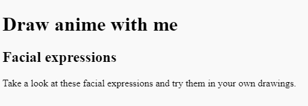

## Start your web page

In this step, you will add a header and an introduction to your anime webpage.

<iframe src="https://trinket.io/embed/html/dd0c7afd18?outputOnly=true" width="350" height="250" frameborder="0" marginwidth="0" marginheight="0" allowfullscreen></iframe>

In HTML you can type words directly into the code and it will appear, unformatted, on the webpage.

--- task ---

**Try it:** Type some words into the left-hand side of the project below. The words you type will automatically appear on the webpage to the right. 

+ What happens if you type multiple lines of text? 
+ Would you like to view a webpage that looked like this? 

<iframe src="https://trinket.io/embed/html/d932ddf89f" width="100%" height="350" frameborder="0" marginwidth="0" marginheight="0" allowfullscreen></iframe>

--- /task ---

--- task ---

Open the [starter project](https://trinket.io/html/2d58893157){:target="_blank"}.

--- /task ---

--- task ---

Your starter project contains some HTML that you will learn more about throughout the project. To make your code easier to read you can collapse parts of it that you don't need to focus on right now. 

Click on the small triangle next to line 3 to collapse the `<head>`.

--- /task ---

### Add a header 

Typically, a webpage has three parts. A **header**, the **main** content and a **footer**. 

--- task ---

Comments are useful for understanding and organising your code. Comments are ignored by the web browser. 

Find the comment `<!-- The page header code goes here -->`.

--- /task ---

HTML documents contain **elements** including paragraphs, headings and images. An element is typically made up of a starting tag, some content and a closing tag.

A **tag** lets the browser know what kind of element it is. Tags start and end with angle brackets `<>`. Note that the end tag has a `/`. 

--- task ---

Underneath the comment, find the `<header>` and `</header>` tags; everything you add here will appear in your webpage header and will be styled as a header using CSS.

--- /task ---

A `<h1>` tag is used to say that this content is the largest header on the page. 

--- task ---

Add `<h1></h1>` **tags** inside your `<header></header>` tags.

**Tip:** When you add a start tag, the end tag will automatically be added so you don't need to type it.

--- code ---
---
language: html
filename: index.html
line_numbers: true
line_number_start: 26
line_highlights: 29
---
  <body>
    <!-- The page header code goes here -->
    <header>
      <h1></h1>
    </header>

--- /code ---

**Tip:** It's a good idea to add spaces at the beginning of lines to indent your code to make it easier to read. In HTML, you don’t need to add in the indents for the code to work.

--- /task ---

--- task ---

Add the text `Draw anime with me` between the two `<h1>` tags. 

--- code ---
---
language: html
filename: index.html
line_numbers: true
line_number_start: 26
line_highlights: 29
---
  <body>
    <!-- The page header code goes here -->
    <header>
      <h1>Draw anime with me</h1>
    </header>

--- /code ---

--- /task ---

--- task ---

**Test:** Your web page will update as you type. You can see that some basic styling has been applied to the text. It is bold and large. 

--- /task ---

### Add the first section in your main content

--- task ---

Any main content should be placed between the `<main>` tags. On this webpage, the main content is broken down into **sections**. 

Your webpage will have an Introduction section, add `<section></section>` tags between the `<main>` tags. 

**Tip:** Your section will have other tags inside it as you build your webpage. Position your cursor between the `<section>` and `</section>` tag then press enter on your keyboard to split the tags across multiple lines. 

--- code ---
---
language: html
filename: index.html
line_numbers: true
line_number_start: 33
line_highlights: 34-36
---
     <main>   
      <section>

      </section> 

--- /code ---

--- /task ---

--- task ---

You are now going to add a subheading within the section that you have just created.

Add the subheading tags `<h2>` between the `<section>` tags.

--- code ---
---
language: html
filename: index.html
line_numbers: true
line_number_start: 33
line_highlights: 35
---
    <main>
      <section>    
        <h2></h2>
      </section> 
    </main>

--- /code ---

--- /task ---

--- task ---

Now enter the subheading text `Facial expressions` between the `<h2>` tags. Your code should look like this:

--- code ---
---
language: html
filename: index.html
line_numbers: true
line_number_start: 33
line_highlights: 35
---
     <main>
      <section>
        <h2>Facial expressions</h2>
      </section>

--- /code ---

Notice how the text on your webpage is slightly smaller than the big heading above and has bold styling. This is because `<h2>` is a smaller heading than `<h1>`.

--- /task ---

--- task ---

You are now going to add a paragraph of text as an introduction to your anime webpage. 

Underneath your `<h2>` heading code, add the paragraph `
` tags. 

  --- code ---
  ---
  language: html
  filename: index.html
  line_numbers: true
  line_number_start: 33
  line_highlights: 36
  ---
    <main>
      <section>
        <h2>Facial expressions</h2>     
        

      </section>

--- /code ---

--- /task ---

--- task ---

Between the `
` tags, you need to add in the introductory text. This is:

`Take a look at these facial expressions and try them in your own drawings.`

**Tip:** You can highlight the text above and then right-click (tap and hold on mobile) and choose 'Copy'. Then click between the `
` tags in your code and then right-click and choose 'Paste'.

Your code should look like this:

--- code ---
---
language: html
filename: index.html
line_numbers: true
line_number_start: 33
line_highlights: 36
---
   <main>
      <section>
        <h2>Facial expressions</h2>     
        
Take a look at these facial expressions and try them in your own drawings.

      </section>

--- /code ---

--- /task ---

--- task ---

**Test:** You can now see that the text appears under the subheading and uses the default paragraph styling. 

Well done! Your page now has a header, subheading and an introductory paragraph. 

--- /task ---

## Save your project

Your project is saved automatically. If you return to the starter link in the same web browser then you will see your changes. 

--- collapse ---

---
title: I accidentally closed my web project
---

Click on the [starter project](https://trinket.io/html/2d58893157){:target="_blank"} link to open your project. If you are using the same web browser you will see your changes.

--- /collapse ---

--- collapse ---

---
title: If you have a Trinket account
---

Click the 'Remix' button to create a copy of the project in your Trinket account. This will save a copy of the trinket on your 'My Trinkets' profile.

--- /collapse ---