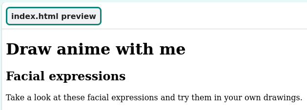

## Add a header and introduction

In this step, you will add a header and an introduction to your anime webpage.

{:width="300px"}

In HTML you can type words directly into the code and it will appear, unformatted, on the webpage.

--- task ---

**Try it:** Type some words into the left-hand side of the project below. The words you type will automatically appear on the webpage to the right. 

+ What happens if you type multiple lines of text? 
+ Would you like to view a webpage that looked like this? 

<iframe src="https://trinket.io/embed/html/d932ddf89f" width="100%" height="350" frameborder="0" marginwidth="0" marginheight="0" allowfullscreen></iframe>

--- /task ---

--- task ---

If working **online**, open the [starter project](https://rpf.io/p/en/projectName-on){:target="_blank"} in Scratch.
 
If working **offline**, open the project [starter file](https://rpf.io/p/en/projectName-get){:target="_blank"} in the Scratch offline editor. If you need to download and install Scratch, you can find it [here](https://scratch.mit.edu/download){:target="_blank"}.

You should see...
 

--- /task ---

--- task ---

Step content...

--- /task ---

--- save ---
