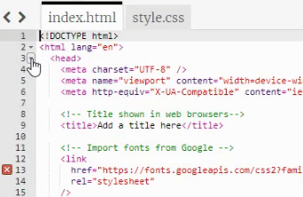

## Style your page

You have used HTML to add tags to your webpage. Now it is time to use CSS to add styles to your page. By the end of this step your webpage will have colours, fonts and borders. 

<iframe src="https://trinket.io/embed/html/931f275be7?outputOnly=true" width="350" height="700" frameborder="0" marginwidth="0" marginheight="0" allowfullscreen></iframe>

--- task ---

Unfold the `<head>` section of your code so that you can view the code inside it.

--- /task ---

### Linking the CSS file

**Cascading Style Sheets (CSS)** is the language that you use to tell the web browser exactly how your webpage should look. Including the positioning, colours and fonts. 

Every rule in CSS is made up of two parts: the **selector** and the **declaration**.

The **selector** is the part of HTML that you want to style. In this example it is `h1`. 

  <pre>h1 {
    color:blue;
    font-size:12px;
  }</pre>

The **declaration** is in curly brackets `{}`, it gives instructions of the styles that should be used. 

<pre>h1 {
  color:blue;
  font-size:12px;
}</pre>

The starter project includes a CSS file which contains a set of useful rules. 

--- task ---

At the bottom of your `<head></head>` section, there is a link to the CSS style sheet that is currently commented out so that it appears in a different colour and is ignored by the web browser. 

Remove the `<!--` and `-->` arrows from the start and end of the code on line 23.

--- code ---
---
language: html
filename: index.html
line_numbers: true
line_number_start: 21
line_highlights: 23
---   
    <!-- Include CSS style file -->

    <link href="style.css" rel="stylesheet" type="text/css" />
  </head>

--- /code ---

--- /task ---

--- task ---

**Test:** HTML elements have default browser styles that you will have seen as you have been writing your HTML code. 

Take a look at your webpage in the right hand pane. Note that the styles and layout of your output has now changed. 

--- /task ---

--- task ---

Click on the `style.css` tab in Trinket to view the code in the CSS file. This CSS file contains all of the CSS for your project, you will find out about some key parts of it as you create your webpage. 

**Find:** the rule that controls the style of the `<h2>` elements on line 162. 

--- code ---
---
language: css
filename: style.css
line_numbers: true
line_number_start: 162
line_highlights: 162-166
---  

h2 {
  font: var(--title-font); /* Font style stored in the title-font variable */
  text-align: center; /* Put the heading in the center across the page */
  padding: 1.5rem; /* Add some space all around the heading */
}

--- /code ---

This rule states which font should be used, how the text should be aligned and how much space should be around the header. 

--- /task ---

You can write your own rules in CSS to tell the browser how something should look. The starter project has some custom CSS rules written for you.

--- task ---

The CSS file has a custom CSS class called `border-bottom` this will add a thick, solid coloured line border to the bottom of any HTML element that uses it.

Go to your `index.html` file find your `header` add code to apply `border-bottom` the CSS rules. 

--- code ---
---
language: html
filename: index.html
line_numbers: true
line_number_start: 26
line_highlights: 29
---
  <body>
    <!-- The page header code goes here -->
    <header class="border-bottom">
      <h1>Draw anime with me</h1>
    </header>

--- /code ---

--- /task ---

--- task ---

Add the `border-top` custom CSS class to your `footer` code to apply a thick coloured line to the top of the footer. 

--- code ---
---
language: html
filename: index.html
line_numbers: true
line_number_start: 26
line_highlights: 29
---
  <!-- Webpage footer -->
    <footer class="secondary">

--- /code ---

--- /task ---

--- task ---
css contains colour palettes go and look
--- /task ---

--- task ---
add primary to main
--- /task ---

--- task ---
add secondary to header
--- /task ---

--- task ---
add tertiary to footer 
--- /task ---

--- task ---
add tertiary to section
--- /task ---

--- task ---
add xcenter to p in section
--- /task ---

Web pages can be viewed on many different devices and should be **responsive** to each device. This means that if a user views your site on a mobile phone, it should respond to a smaller screen and if they view it on a desktop PC it should respond to a larger screen. 

--- task ---
add wrap to section
--- /task ---

--- task ---
**Test:** Drag the bar between the text editor and your web page and make the web page narrower. 

The text should move below the image. This is the layout that users with a mobile phone in portrait mode will see. 

Drag the bar back after testing so you can see the image and text side-by side. 

--- /task ---
