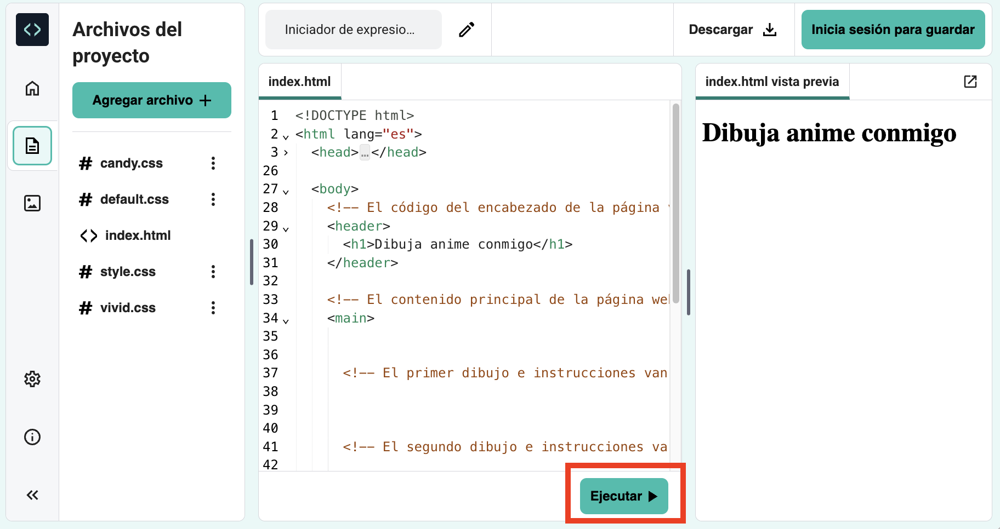

## Inicia tu página web

En este paso, agregarás un encabezado y una introducción a tu página web de anime.

<iframe src="https://editor.raspberrypi.org/es-LA/embed/viewer/anime-expressions-step-2" width="500" height="400" frameborder="0" marginwidth="0" marginheight="0" allowfullscreen> </iframe>

En HTML puedes escribir palabras directamente en el código para que las palabras aparezcan sin formato en la página web.

--- task ---

Abre el [Proyecto de inicio de expresiones de anime](https://editor.raspberrypi.org/es-LA/projects/anime-expressions-starter){:target="_blank"}.

--- /task ---

--- task ---

Tu proyecto inicial contiene algo de HTML sobre el que aprenderás más a lo largo del proyecto.

Para que tu código sea más fácil de leer, puedes contraer las partes que no necesitas por el momento.

Haz clic en el triángulo junto a la linea 3 para contraer el `<head>`.

--- /task ---

### Añade un encabezado

Por lo general, una página web tiene tres partes. Un **encabezado**, el contenido **principal** y un **pie de página**.

--- task ---

Puedes usar comentarios para organizar tu código y ayudar a la gente a entender el código. Los comentarios son ignorados por el navegador web.

**Busca** el comentario `<!-- El código del encabezado de la página va aquí -->`.

--- collapse ---

---
title: No puedo encontrar el comentario
---

¿Ha colapsado accidentalmente el `<body>` u otra sección de su página web?

Haz clic en el triángulo para ampliar el código.

--- /collapse ---

--- /task ---

Los documentos HTML contienen **elementos** incluyendo párrafos, encabezados e imágenes. Un elemento se compone típicamente de una etiqueta de comienzo, algún contenido y una etiqueta de cierre.

Una **etiqueta** permite al navegador saber qué tipo de elemento es. Las etiquetas comienzan y terminan con corchetes angulares `<>`. La etiqueta final también tiene un `/`.

--- task ---

Debajo del comentario, encuentra las etiquetas `<header>` y `</header>`. Todo lo que agregas aquí aparece en el encabezado de tu página web y está diseñado como un encabezado.

--- /task ---

Una etiqueta `<h1>` se utiliza para decir que este contenido es el encabezado más grande de la página.

--- task ---

Añade **etiquetas** `<h1></h1>` dentro de tus etiquetas `<header></header>`.

**Tip:** Cuando agregas una etiqueta de inicio, la etiqueta final se agrega automáticamente, por lo que no necesitas escribirla.

--- code ---
---
language: html
filename: index.html
line_numbers: true
line_number_start: 27
line_highlights: 30
---
  <body>
    <!-- El código del encabezado de la página va aquí -->
    <header>
      <h1></h1>
    </header>

--- /code ---

**Tip:** Es una buena idea añadir espacios al principio de las líneas para identar tu código. En HTML, no es necesario añadir indentación para que el código funcione, pero esto hace que sea más fácil de leer.

--- /task ---

--- task ---

Añade el texto `Dibuja anime conmigo` entre las dos etiquetas `<h1>`.

--- code ---
---
language: html
filename: index.html
line_numbers: true
line_number_start: 27
line_highlights: 30
---
  <body>
    <!-- El código del encabezado de la página va aquí -->
    <header>
      <h1>Dibuja anime conmigo</h1>
    </header>

--- /code ---

--- /task ---

--- task ---

**Prueba:** Haz clic en el botón **Ejecutar**.

La salida aparecerá a la derecha:

Verás que el texto dentro de las etiquetas de `<h1>` está diseñado como negrita con una fuente grande.

--- /task ---

### Añade la primera sección en tu contenido principal

Cualquier contenido principal debe colocarse entre las etiquetas `<main>`. En tu página web, el contenido principal se divide en **secciones**.

--- task ---

Tu página web necesita una sección de introducción. Añade etiquetas `<section></section>` entre las etiquetas `<main>`.

**Tip:** A medida que crees tu página web, añadirás otras etiquetas dentro de tu sección. Coloca tu cursor entre la etiqueta `<section>` y `</section>`, luego presione Enter en su teclado para dividir las etiquetas en múltiples líneas.

--- code ---
---
language: html
filename: index.html
line_numbers: true
line_number_start: 33
line_highlights: 35-37
---
    <!-- El contenido principal de la página web va entre las etiquetas principales -->
    <main>
      <section>

      </section>
        <!-- El primer dibujo e instrucciones van aquí -->  

--- /code ---

--- /task ---

--- task ---

Ahora vas a agregar un subtítulo dentro de la sección que acabas de crear.

Añade las etiquetas de subtítulo `<h2>` entre las etiquetas `<section>`.

--- code ---
---
language: html
filename: index.html
line_numbers: true
line_number_start: 33
line_highlights: 36
---
    <!-- El contenido principal de la página web va entre las etiquetas principales -->
    <main>
      <section>
        <h2></h2>
      </section>
        <!-- El primer dibujo e instrucciones van aquí --> 

--- /code ---

--- /task ---

--- task ---

Ahora ingresa el texto del subtítulo `Expresiones faciales` entre las etiquetas `<h2>`. Tu código debería verse así:

--- code ---
---
language: html
filename: index.html
line_numbers: true
line_number_start: 33
line_highlights: 36
---
    <!-- El contenido principal de la página web va entre las etiquetas principales -->
    <main>
      <section>
        <h2>Expresiones faciales</h2>
      </section>
        <!-- El primer dibujo e instrucciones van aquí --> 

--- /code ---

--- /task ---

--- task ---

**Prueba:** Haz clic en el botón **Ejecutar**.

Observe cómo el texto de su página web es ligeramente más pequeño que el encabezado grande de arriba y tiene un estilo en negrita. Esto se debe a que `<h2>` es un encabezado más pequeño que `<h1>`.

--- /task ---

--- task ---

Ahora va a añadir un párrafo de texto como introducción a tu página web de anime.

Debajo del código de encabezado `<h2>`, añade las etiquetas de párrafo `
`.

  --- code ---
  ---
  language: html
  filename: index.html
  line_numbers: true
  line_number_start: 33
  line_highlights: 37
  ---
    <!-- El contenido principal de la página web va entre las etiquetas principales -->
    <main>
      <section>
        <h2>Expresiones faciales</h2>
        

      </section>
        <!-- El primer dibujo e instrucciones van aquí --> 

--- /code ---

--- /task ---

--- task ---

Entre las etiquetas `
`, debes agregar este texto introductorio:

`Echa un vistazo a estas expresiones faciales e intentalas en tus propios dibujos.`

**Tip:** Puedes resaltar el texto de arriba y luego hacer clic derecho (mantener presionado en el dispositivo móvil) y elegir “Copiar”. Luego haga clic entre las etiquetas `
` en su código y luego haga clic derecho y elija 'Pegar'.

Tu código debería verse así:

--- code ---
---
language: html
filename: index.html
line_numbers: true
line_number_start: 33
line_highlights: 37
---
    <!-- El contenido principal de la página web va entre las etiquetas principales -->
    <main>
      <section>
        <h2>Expresiones faciales</h2>
        
Echa un vistazo a estas expresiones faciales e intentalas en tus propios dibujos.

      </section>
        <!-- El primer dibujo e instrucciones van aquí --> 

--- /code ---

--- /task ---

--- task ---

**Prueba:** Haz clic en el botón **Ejecutar**.

El texto aparece debajo del subencabezado y utiliza el estilo de párrafo predeterminado.

¡Bien hecho! Tu página ahora tiene un encabezado, un subencabezado y un párrafo introductorio.

<iframe src="https://editor.raspberrypi.org/es-LA/embed/viewer/anime-expressions-step-2" width="500" height="400" frameborder="0" marginwidth="0" marginheight="0" allowfullscreen> </iframe>

--- /task ---

## Guarda tu proyecto

Tu proyecto se ha guardado automáticamente. Regresa al enlace de inicio en el mismo navegador web para ver los cambios.

--- collapse ---

---
title: He cerrado accidentalmente mi proyecto
---

Haga clic en el enlace [Proyecto de iniciación](https://editor.raspberrypi.org/es-LA/projects/anime-expressions-starter){:target="_blank"} para abrir su proyecto. Utilice el mismo navegador web para ver sus cambios.

--- /collapse ---

--- collapse ---

---
title: Si tienes una cuenta del Editor de Código
---

Haga clic en el botón 'Guardar' para crear una copia del proyecto en su cuenta Raspberry Pi.

--- /collapse ---
