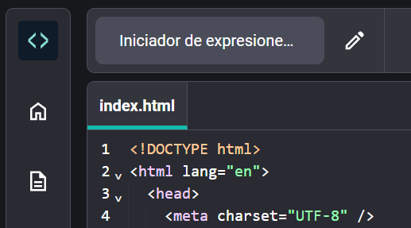
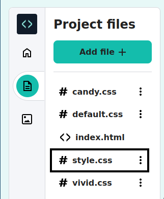

## Dale estilo a tu página

Has usado HTML para añadir etiquetas a tu página web.

Ahora es el momento de usar CSS para añadir estilos a tu página.

Este paso te muestra cómo cambiar los colores, las fuentes y el diseño en tu página web.

<iframe src="https://editor.raspberrypi.org/es-LA/embed/viewer/anime-expressions-step-4" width="500" height="400" frameborder="0" marginwidth="0" marginheight="0" allowfullscreen> </iframe>

**Hojas de estilo en cascada (CSS)** es el lenguaje que utiliza para indicarle al navegador web exactamente cómo debe verse su página web, lo que incluye el posicionamiento, los colores y las fuentes. A esto le llamamos estilo.

Cada **regla** en CSS se compone de dos partes: el **selector** y la **declaración**.

El **selector** es la parte de HTML a la que quieres darle estilo. En este ejemplo es `h1`.

  <pre>h1 {
  color: blue;
  font-size: 12px;
}</pre>

 

La **declaración** está entre llaves `{}`. Da instrucciones de los estilos que deben ser usados.

<pre>h1 {
  color: blue;
  font-size: 12px;
}</pre>

 

### Enlazar el archivo CSS

El proyecto de iniciación incluye archivos CSS, que contienen un conjunto de reglas útiles.

--- task ---

Despliega la sección `<head>` de tu código para que puedas ver el código dentro de él.

--- /task ---

--- task ---

En la parte inferior de la sección `<head></head>`, hay enlaces a dos hojas de estilo CSS que actualmente están comentadas para que el navegador web las ignore.

Elimina las flechas `<!--` y `-->` del principio y el final de ambas líneas del código del enlace:

**Antes**

--- code ---
---
language: html
filename: index.html
line_numbers: true
line_number_start: 21
line_highlights: 23-24
---   
    <!-- Incluir archivo de estilo CSS -->

    <!-- <link href="style.css" rel="stylesheet" type="text/css" /> -->
    <!-- <link href="candy.css" rel="stylesheet" type="text/css" /> -->
  </head>

--- /code ---

**Después**

--- code ---
---
language: html
filename: index.html
line_numbers: true
line_number_start: 21
line_highlights: 23-24
---   
    <!-- Incluir archivo de estilo CSS -->

    <link href="style.css" rel="stylesheet" type="text/css" />
    <link href="candy.css" rel="stylesheet" type="text/css" />
  </head>

--- /code ---
--- /task ---

--- task ---

**Prueba:** Haz clic en el botón **Ejecutar**.

Los elementos HTML tienen estilos de navegador predeterminados que has visto como has escrito tu código HTML.

Eche un vistazo a su página web en el panel derecho. Observe que los estilos y el diseño de su salida han cambiado.

**Tip:** Para contraer la sección `<head>` después de haber visto el cambio, haga clic en la flecha junto a ella.

--- /task ---

--- task ---

Haga clic en el icono `Archivos de proyecto` en el Editor de código y luego seleccione el archivo `style.css` para abrirlo en una nueva pestaña.

Este archivo CSS contiene todo el CSS para tu proyecto. Encontrarás algunas partes clave de este archivo CSS a medida que crees tu página web.

Cuando añades estilo CSS a un **elemento**, se aplica ese estilo a cada elemento de la página que tiene la misma etiqueta.

**Buscar:** Desplácese hacia abajo y encuentre la regla que controla el estilo de la `<h2>`.

--- code ---
---
language: css
filename: style.css
line_numbers: true
line_number_start: 109
line_highlights: 109-113
---  

h2 {
  font: var(--title-font); /* Estilo de fuente almacenado en la variable title-font */
  text-align: left; /* Alinear el texto */
  padding: 1.5rem; /* Añade algo de espacio alrededor del encabezado */
}

--- /code ---

Esta regla establece qué fuente debe ser utilizada, cómo el texto debe ser alineado, y cuánto espacio debe haber alrededor del encabezado.

--- /task ---

--- task ---

En este momento, el encabezado `<h2>` está alineado a la izquierda.

Cambia la propiedad `text-align` de la regla `h2` a `center`.

--- code ---
---
language: css
filename: style.css
line_numbers: true
line_number_start: 109
line_highlights: 111
---  

h2 {
  font: var(--title-font); /* Estilo de fuente almacenado en la variable title-font */
  text-align: center; /* Alinear el texto */
  padding: 1.5rem; /* Añade algo de espacio alrededor del encabezado */
}

--- /code ---

--- /task ---

--- task ---

**Prueba:** Haz clic en el botón **Ejecutar**.

Eche un vistazo a su página web y asegúrese de que el texto de "expresiones faciales" está centrado.

**Depuración:** Compruebe la ortografía de la palabra `center`. HTML utiliza la ortografía en inglés estadounidense (US).

<iframe src="https://editor.raspberrypi.org/es-LA/embed/viewer/anime-expressions-step-4" width="500" height="750" frameborder="0" marginwidth="0" marginheight="0" allowfullscreen> </iframe>

--- /task ---

