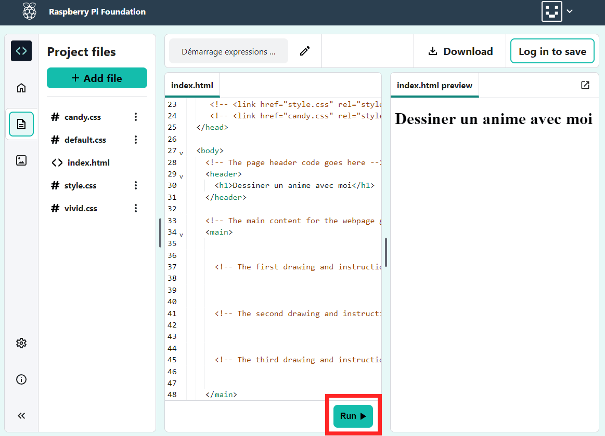

## Commencer ta page web

<div style="display: flex; flex-wrap: wrap">
<div style="flex-basis: 200px; flex-grow: 1; margin-right: 15px;">
Dans cette étape, tu ajouteras un en-tête et une introduction à ta page web d'anime.
</div>
<div>
<iframe src="https://editor.raspberrypi.org/en/embed/viewer/anime-expressions-step-2" width="500" height="400" frameborder="0" marginwidth="0" marginheight="0" allowfullscreen> </iframe>
</div>
</div>

En HTML, tu peux taper des mots directement dans le code pour qu'ils apparaissent, non formatés, sur la page web.

\--- task ---

Ouvre le [Projet de démarrage d'expressions d'anime](https://editor.raspberrypi.org/fr-FR/projects/anime-expressions-starter){:target="_blank"}.

\--- /task ---

\--- task ---

Ton projet de démarrage contient du code HTML sur lequel tu en apprendras davantage tout au long du projet.

Pour rendre ton code plus facile à lire, tu peux réduire les parties dont tu n'as pas besoin pour le moment.

Clique sur le petit triangle à côté de la ligne 3 pour réduire le `<head>`.


\--- /task ---

### Ajouter un en-tête

Habituellement, une page web a trois parties. Un **en-tête**, le contenu **principal** et un **pied de page**.

\--- task ---

Tu peux utiliser des commentaires pour organiser ton code et aider les gens à comprendre le code. Les commentaires sont ignorés par le navigateur web.

**Trouve** le commentaire `<!-- Le code d'en-tête de la page va ici -->`.

\--- collapse ---

---

## title: Je ne trouve pas le commentaire

As-tu accidentellement réduit le `<body>` ou une autre section de ta page web ?

Clique sur le triangle ▸ pour développer le code.

\--- /collapse ---

\--- /task ---

Les documents HTML contiennent des **éléments** incluant des paragraphes, des en-têtes et des images. Un élément est généralement composé d'une balise ouvrante, d'un contenu et d'une balise fermante.

Une **balise** permet au navigateur de savoir quel type d'élément il s'agit. Les balises commencent et se terminent par des chevrons `<>`. La balise fermante a également un `/`.

\--- task ---

Sous le commentaire, trouve les balises `<header>` et `</header>`. Tout ce que tu ajoutes ici apparaît dans l'en-tête de ta page web et est stylisé comme un en-tête.

\--- /task ---

Une balise `<h1>` est utilisée pour dire que ce contenu est l'en-tête le plus grand de la page.

\--- task ---

Ajoute des **balises** `<h1></h1>` dans tes balises `<header></header>`.

**Astuce :** lorsque tu ajoutes une balise ouvrante, la balise fermante est automatiquement ajoutée pour que tu n'aies pas besoin de la taper.

## --- code ---

language: html
filename: index.html
line_numbers: true
line_number_start: 27
line_highlights: 30
--------------------------------------------------------

  <body>
    <!-- The page header code goes here -->
    <header>
      <h1></h1>
    </header>

\--- /code ---

**Astuce :** c'est une bonne idée d'ajouter des espaces au début des lignes pour indenter ton code. En HTML, tu n'as pas besoin d'ajouter les indents pour que le code fonctionne, mais cela rend ton code plus facile à lire.

\--- /task ---

\--- task ---

Ajoute le texte 'Dessiner un anime avec moi' entre les deux balises `<h1>`.

## --- code ---

language: html
filename: index.html
line_numbers: true
line_number_start: 27
line_highlights: 30
--------------------------------------------------------

  <body>
    <!-- The page header code goes here -->
    <header>
      <h1>Draw anime with me</h1>
    </header>

\--- /code ---

\--- /task ---

\--- task ---

**Test :** clique sur le bouton **Run**.

La sortie apparaîtra à droite :



Tu verras que le texte à l'intérieur des balises `<h1>` est en gras avec une police de grande taille.

\--- /task ---

### Ajouter la première section dans ton contenu principal

Tout contenu principal doit être placé entre les balises `<main>`. Sur ta page web, le contenu principal est divisé en **sections**.

\--- task ---

Ta page web a besoin d'une section d'introduction. Ajoute des balises `<section></section>` entre les balises `<main>`.

\*\*Astuce :\*\*au fur et à mesure que tu construis ta page web, tu ajouteras d'autres balises dans ta section. Positionne ton curseur entre la balise `<section>` et `</section>`, puis appuie sur Entrée sur ton clavier pour scinder les balises sur plusieurs lignes.

## --- code ---

language: html
filename: index.html
line_numbers: true
line_number_start: 33
line_highlights: 35-37
-----------------------------------------------------------

```
<!-- The main content for the webpage goes between the main tags -->
<main>
  <section>

  </section>
    <!-- The first drawing and instructions go here -->  
```

\--- /code ---

\--- /task ---

\--- task ---

Tu vas maintenant ajouter un sous-titre dans la section que tu viens de créer.

Ajoute les balises de sous-titre `<h2>` entre les balises `<section>`.

## --- code ---

language: html
filename: index.html
line_numbers: true
line_number_start: 33
line_highlights: 36
--------------------------------------------------------

```
<!-- The main content for the webpage goes between the main tags -->
<main>
  <section>
    <h2></h2>
  </section>
    <!-- The first drawing and instructions go here --> 
```

\--- /code ---

\--- /task ---

\--- task ---

Maintenant, entre le texte de sous-titre `Expressions faciales` entre les balises `<h2>`. Ton code devrait ressembler à ceci :

## --- code ---

language: html
filename: index.html
line_numbers: true
line_number_start: 33
line_highlights: 36
--------------------------------------------------------

```
<!-- The main content for the webpage goes between the main tags -->
<main>
  <section>
    <h2>Facial expressions</h2>
  </section>
    <!-- The first drawing and instructions go here --> 
```

\--- /code ---

\--- /task ---

\--- task ---

**Test :** clique sur le bouton **Run**.

Remarque que le texte de ta page web est légèrement plus petit que le grand titre ci-dessus et qu'il est en gras. C'est parce que `<h2>` est un titre plus petit que `<h1>`.

\--- /task ---

\--- task ---

Tu vas maintenant ajouter un paragraphe de texte comme introduction à ta page web d'anime.

Sous ton code de titre `<h2>`, ajoute les balises de paragraphe `<p>`.

## --- code ---

language: html
filename: index.html
line_numbers: true
line_number_start: 33
line_highlights: 37
--------------------------------------------------------

```
<!-- The main content for the webpage goes between the main tags -->
<main>
  <section>
    <h2>Facial expressions</h2>
    <p></p>
  </section>
    <!-- The first drawing and instructions go here --> 
```

\--- /code ---

\--- /task ---

\--- task ---

Entre les balises `<p>`, tu dois ajouter ce texte d'introduction :

'Jette un œil à ces expressions faciales et essaie-les dans tes propres dessins.'

**Astuce :** tu peux mettre en surbrillance le texte ci-dessus puis faire un clic droit (appuie et maintiens enfoncé sur mobile) et choisis 'Copier'. Puis clique entre les balises `<p>` dans ton code, puis fais un clic droit et choisis 'Coller'.

Ton code devrait ressembler à ceci :

## --- code ---

language: html
filename: index.html
line_numbers: true
line_number_start: 33
line_highlights: 37
--------------------------------------------------------

```
<!-- The main content for the webpage goes between the main tags -->
<main>
  <section>
    <h2>Facial expressions</h2>
    <p>Take a look at these facial expressions and try them in your own drawings.</p>
  </section>
    <!-- The first drawing and instructions go here --> 
```

\--- /code ---

\--- /task ---

\--- task ---

**Test :** clique sur le bouton **Run**.

Le texte apparaît sous le sous-titre et utilise le style de paragraphe par défaut.

Bien joué ! Ta page a maintenant un en-tête, un sous-titre et un paragraphe d'introduction.

<div>
<iframe src="https://editor.raspberrypi.org/en/embed/viewer/anime-expressions-step-2" width="500" height="400" frameborder="0" marginwidth="0" marginheight="0" allowfullscreen> </iframe>
</div>

\--- /task ---

## Enregistre ton projet

Ton projet est enregistré automatiquement. Retourne au lien de démarrage dans le même navigateur web pour voir tes modifications.

\--- collapse ---

---

## title: J'ai accidentellement fermé mon projet

Clique sur le lien [projet de démarrage](https://editor.raspberrypi.org/en/projects/anime-expressions-starter){:target="_blank"} pour ouvrir ton projet. Utilise le même navigateur web pour voir tes modifications.

\--- /collapse ---

\--- collapse ---

---

## title: Si tu as un compte Code Editor

Clique sur le bouton « Save » pour créer une copie du projet dans ton compte Raspberry Pi.

\--- /collapse ---
