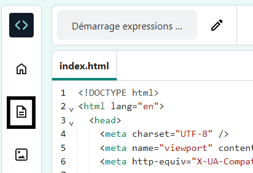

## Styliser ta page

<div style="display: flex; flex-wrap: wrap">
<div style="flex-basis: 200px; flex-grow: 1; margin-right: 15px;">

Tu as utilisé HTML pour ajouter des balises à ta page web.

Maintenant, il est temps d'utiliser CSS pour ajouter des styles à ta page.

Cette étape te montre comment modifier les couleurs, les polices et la mise en page de ta page web.

</div>
<div>
<iframe src="https://editor.raspberrypi.org/en/embed/viewer/anime-expressions-step-4" width="500" height="400" frameborder="0" marginwidth="0" marginheight="0" allowfullscreen> </iframe>
</div>
</div>

<p style="border-left: solid; border-width:10px; border-color: #0faeb0; background-color: aliceblue; padding: 10px;">
<span style="color: #0faeb0">**Cascading Style Sheets (CSS)**</span> sont le langage que tu utilises pour indiquer au navigateur web l'aspect exact de ta page web, ce qui inclut le positionnement, les couleurs et les polices. Nous appelons cela le style.
</p>

Chaque **règle** en CSS est composée de deux parties : le **sélecteur** et la **déclaration**.

Le **sélecteur** est la partie du HTML que tu souhaites styliser. Dans cet exemple, il s'agit de 'h1'.

<div style="background-color:#2d2d2d; padding: 1em;">
  <pre><span style="color:#000; background-color:#d2d2d2; font-family: Consolas, Monaco, 'Andale Mono', 'Ubuntu Mono', monospace; font-size: 1em">h1 <span style=" color:#ccc;  font-family: Consolas, Monaco, 'Andale Mono', 'Ubuntu Mono', monospace; font-size: 1em">{
  color: blue;
  font-size: 12px;
}</span></pre>
</div>
<br/>

La **déclaration** est entre accolades `{}`. Elle donne des instructions sur les styles à utiliser.

<div style="background-color:#2d2d2d; padding: 1em;">
<pre><span style="color:#ccc; font-family: Consolas, Monaco, 'Andale Mono', 'Ubuntu Mono', monospace; font-size: 1em">h1 <span style=" color:#000; background-color:#d2d2d2; font-family: Consolas, Monaco, 'Andale Mono', 'Ubuntu Mono', monospace; font-size: 1em">{
  color: blue;
  font-size: 12px;
}</span></pre>
</div>
<br/>

### Lier le fichier CSS

Le projet de démarrage comprend des fichiers CSS, qui contiennent un ensemble de règles utiles.

\--- task ---

Déplie la section `<head>` de ton code afin de pouvoir voir le code qu'il contient.


\--- /task ---

\--- task ---

Au bas de ta section `<head></head>`, tu trouveras des liens vers deux feuilles de style CSS qui sont actuellement commentées afin qu'elles soient ignorées par le navigateur web.

Supprime les flèches `<!--` et `-->` du début et de la fin des deux lignes de code de lien :

**Avant**

## --- code ---

language: html
filename: index.html
line_numbers: true
line_number_start: 21
line_highlights: 23-24
-----------------------------------------------------------

```
<!-- Inclure le fichier de style CSS -->

<!-- <link href="style.css" rel="stylesheet" type="text/css" /> -->
<!-- <link href="candy.css" rel="stylesheet" type="text/css" />-->
```

  </head>

\--- /code ---

**Après**

## --- code ---

language: html
filename: index.html
line_numbers: true
line_number_start: 21
line_highlights: 23-24
-----------------------------------------------------------

```
<!-- Inclure le fichier de style CSS -->

<link href="style.css" rel="stylesheet" type="text/css" />
<link href="candy.css" rel="stylesheet" type="text/css" />
```

  </head>

\--- /code ---
\--- /task ---

\--- task ---

**Test :** clique sur le bouton **Run**.

Les éléments HTML ont des styles de navigateur par défaut que tu as vus lorsque tu as écrit ton code HTML.

Jette un coup d'œil à ta page web dans le volet de droite. Note que les styles et la mise en page de ta sortie ont maintenant changé.

**Astuce :** pour réduire la section '<head>' après avoir constaté le changement, clique sur la flèche à côté.

\--- /task ---

\--- task ---

Clique sur l'icône 'Project files' dans le Code Editor puis sélectionne le fichier 'style.css' ouvert dans un nouvel onglet.




Ce fichier CSS contient tout le CSS pour ton projet. Tu découvriras certains éléments clés de ce fichier CSS lors de la création de ta page web.

Quand tu ajoutes un style CSS à un **élément**, il applique ce style à chaque élément de la page qui a la même balise.

**Rechercher :** fais défiler vers le bas et recherche la règle qui contrôle le style du `<h2>`.

## --- code ---

language: css
filename: style.css
line_numbers: true
line_number_start: 109
line_highlights: 109-113
-------------------------------------------------------------

h2 {
font: var(--title-font); /\* Font style stored in the title-font variable _/
text-align: left; /_ Align the text _/
padding: 1.5rem; /_ Add some space all around the heading \*/
}

\--- /code ---

Cette règle indique quelle police doit être utilisée, comment le texte doit être aligné et combien d'espace doit être autour de l'en-tête.

\--- /task ---

\--- task ---

Pour le moment, l'en-tête `<h2>` est aligné à gauche.

Change la propriété `text-align` de la règle `h2` en `center`.

## --- code ---

language: css
filename: style.css
line_numbers: true
line_number_start: 109
line_highlights: 111
---------------------------------------------------------

h2 {
font: var(--title-font); /\* Font style stored in the title-font variable _/
text-align: center; /_ Align the text _/
padding: 1.5rem; /_ Add some space all around the heading \*/
}

\--- /code ---

\--- /task ---

\--- task ---

**Test :** clique sur le bouton **Run**.

Regarde ta page web et assure-toi que le texte 'Expressions faciales' est centré.

**Débogage :** vérifie l'orthographe du mot `center`. HTML utilise l’orthographe anglaise américaine (US).

<iframe src="https://editor.raspberrypi.org/en/embed/viewer/anime-expressions-step-4" width="500" height="750" frameborder="0" marginwidth="0" marginheight="0" allowfullscreen> </iframe>

\--- /task ---
