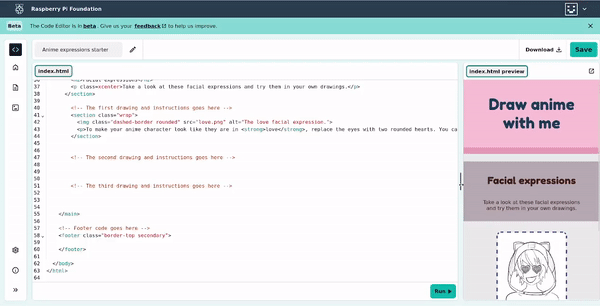

## Styliser avec des classes

Cette étape te montre comment ajouter des classes pour personnaliser les styles de ta page.

<iframe src="https://editor.raspberrypi.org/fr-FR/embed/viewer/anime-expressions-step-5" width="500" height="400" frameborder="0" marginwidth="0" marginheight="0" allowfullscreen> </iframe>

Si tu veux appliquer un style à des éléments spécifiques, tu peux créer une **classe** dans un fichier CSS. Tu peux ensuite ajouter un **attribut** `class=` à un élément de ton code HTML pour indiquer au navigateur quel style doit être appliqué.

Le style de classe remplace tout style d’élément déjà appliqué. Note que les changements ont lieu au fur et à mesure que tu ajoutes les classes à ton code.

--- task ---

Ton fichier CSS possède une classe CSS personnalisée appelée 'border-bottom'. Cette classe ajoute une bordure épaisse de couleur unie au bas de tout élément HTML qui l'utilise.

Va dans ton fichier `index.html` et trouve ton `header`.

Ajoute `class="border-bottom"` après le mot `header` dans ta balise `header`.

--- code ---
---
language: html
filename: index.html
line_numbers: true
line_number_start: 27
line_highlights: 29
---
  <body>
    <!-- Le code d'en-tête de la page va ici -->
    <header class="border-bottom">
      <h1>Dessiner un anime avec moi</h1>
    </header>

--- /code ---

--- /task ---

--- task ---

Ajoute la classe `border-top` à ton code `footer` pour appliquer une bordure épaisse en haut de ton pied de page.

--- code ---
---
language: html
filename: index.html
line_numbers: true
line_number_start: 55
line_highlights: 56
---
    <!-- Pied de page du site web -->
    <footer class="border-top">

--- /code ---

--- /task ---

La classe `primary` définit une couleur d'arrière-plan et de texte contrastant pour la plupart du contenu principal.

La classe `secondary` définit une combinaison de couleurs supplémentaire qui s'accorde bien avec les couleurs de la classe `primary`.

--- task ---

Ajoute la classe `secondary` à ton code `footer` pour appliquer une couleur d'arrière-plan différente à ton pied de page.

--- code ---
---
language: html
filename: index.html
line_numbers: true
line_number_start: 55
line_highlights: 56
---
    <!-- Pied de page du site web -->
    <footer class="border-top secondary">

--- /code ---

--- /task ---

--- task ---

Ajoute `class="primary"` à `<main>`.

--- code ---
---
language: html
filename: index.html
line_numbers: true
line_number_start: 33
line_highlights: 34
---
    <!-- Le contenu principal de la page web se trouve entre les balises principales -->
    <main class="primary">

--- /code ---

--- /task ---

--- task ---

Ajoute `secondary` à `<header>\`.

--- code ---
---
language: html
filename: index.html
line_numbers: true
line_number_start: 28
line_highlights: 29
---
    <!-- Le code d'en-tête de la page va ici -->
    <header class="border-bottom secondary">

--- /code ---

--- /task ---

La classe `tertiary` définit une combinaison de couleurs supplémentaire qui s'accorde bien avec les couleurs des classes `primary` et `secondary\`.

--- task ---

Ajoute `class="tertiary"` à l'élément **first** `<section>`.

--- code ---
---
language: html
filename: index.html
line_numbers: true
line_number_start: 33
line_highlights: 35
---
    <!-- Le contenu principal de la page web se trouve entre les balises principales -->
    <main class="primary">
      <section class="tertiary">
        <h2>Expressions faciales</h2>
        
Jette un œil à ces expressions faciales et essaie-les dans tes propres dessins.

      </section>

--- /code ---

La classe 'xcenter' de ton fichier CSS aligne les éléments horizontalement sur la page.

--- /task ---

--- task ---

Ajoute `class="xcenter"` à la `
` dans la même section.

--- code ---
---
language: html
filename: index.html
line_numbers: true
line_number_start: 33
line_highlights: 37
---
    <!-- Le contenu principal de la page web se trouve entre les balises principales -->
    <main class="primary">
      <section class="tertiary">
        <h2>Expressions faciales</h2>
        
Jette un œil à ces expressions faciales et essaie-les dans tes propres dessins.

      </section>

--- /code ---

--- /task ---

Les pages web peuvent être consultées sur de nombreux appareils différents et doivent être **responsive** pour chaque appareil. Cela signifie que si un utilisateur consulte ta page sur un téléphone portable, elle doit répondre à un écran plus petit et s'il la consulte sur un ordinateur de bureau, elle doit répondre à un écran plus grand. 

CSS peut changer la mise en page sur une page web, ainsi que changer les couleurs, les polices et les bords.

--- task ---

Trouve la **seconde** `<section>`.

Ajoute `class="wrap"` à la balise `<section>`.

--- code ---
---
language: html
filename: index.html
line_numbers: true
line_number_start: 39
line_highlights: 40
---
    <!-- Le premier dessin et les instructions vont ici -->
    <section class="wrap">
      
      
Pour que ton personnage d'anime semble être amoureux, remplace les yeux par deux cœurs arrondis. Tu peux ajouter trois cœurs supplémentaires à l'intérieur pour un effet amusant.

    </section>

--- /code ---

--- /task ---

Tu peux également ajouter des bordures colorées dans différents styles aux éléments HTML. La classe `dashed-border` dans le fichier de style crée une bordure en pointillés.

--- task ---

Ajoute la classe `dashed-border` à la ``.

--- code ---
---
language: html
filename: index.html
line_numbers: true
line_number_start: 39
line_highlights: 41
---
    <!-- Le premier dessin et les instructions vont ici -->
    <section class="wrap">
      
      
Pour que ton personnage d'anime semble être amoureux, remplace les yeux par deux cœurs arrondis. Tu peux ajouter trois cœurs supplémentaires à l'intérieur pour un effet amusant.

    </section>

--- /code ---

--- /task ---

Tu peux faire arrondir les coins d'un élément à la classe `rounded`.

--- task ---

Ajoute la classe `rounded` à la ``.

--- code ---
---
language: html
filename: index.html
line_numbers: true
line_number_start: 39
line_highlights: 41
---
    <!-- Le premier dessin et les instructions vont ici -->
    <section class="wrap">
      
      
Pour que ton personnage d'anime semble être amoureux, remplace les yeux par deux cœurs arrondis. Tu peux ajouter trois cœurs supplémentaires à l'intérieur pour un effet amusant.

    </section>

--- /code ---

--- /task ---

--- task ---

**Test :** clique sur le bouton **Run**.

Fais glisser la barre entre l'éditeur de texte et ta page web pour rendre la page web plus étroite.

Le texte doit se déplacer sous l'image. Ceci est la mise en page pour les utilisateurs qui voient la page web sur un téléphone mobile.

Fais glisser la barre vers l'arrière après l'avoir testée afin de pouvoir voir l'image et le texte côte à côte.

--- /task ---
