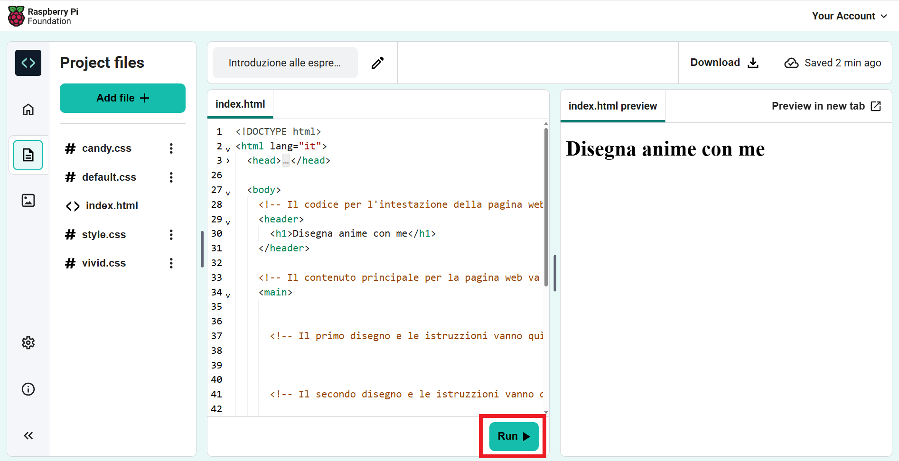

## Inizia la tua pagina web

In questo passo, aggiungerai un'intestazione e un'introduzione alla tua pagina web anime.

<iframe src="https://editor.raspberrypi.org/it-IT/embed/viewer/anime-expressions-step-2" width="500" height="400" frameborder="0" marginwidth="0" marginheight="0" allowfullscreen> </iframe>

In HTML puoi digitare parole direttamente nel codice per far apparire le parole, non formattate, sulla pagina web.

--- task ---

Apri il [Progetto di partenza di espressioni anime](https://editor.raspberrypi.org/it-IT/projects/anime-expressions-starter){:target="_blank"}.

--- /task ---

--- task ---

Il tuo progetto di partenza contiene del codice HTML che imparerai a conoscere meglio nel corso del progetto.

Per rendere il tuo codice più facile da leggere, puoi comprimere le parti che non ti servono in questo momento.

Clicca sul piccolo triangolo vicino alla riga 3 per comprimere il `<head>`.

--- /task ---

### Aggiungi un'intestazione

Tipicamente, una pagina web ha tre parti. Un'**intestazione**, il contenuto **principale**, e un **piè di pagina**.

--- task ---

Puoi usare dei commenti per organizzare il tuo codice e aiutare le persone a capire il codice. I commenti vengono ignorati dal brower web.

**Trova** il commento `<!-- Il codice dell'intestazione della pagina va qui -->`.

--- collapse ---

---
title: Non riesco a trovare il commento
---

Hai compresso il `<body>` o un'altra sezione della pagina web per sbaglio?

Clicca sul ▸ triangolo per espandere il codice.

--- /collapse ---

--- /task ---

I documenti HTML contengono **elementi** tra cui i paragrafi, le intestazioni e le immagini. Un elemento è tipicamente composto da un tag di apertura, alcuni contenuti e un tag di chiusura.

Un **tag** indica al browser di che tipo di elemento si tratta. I tag iniziano e finiscono con le parentesi angolari `<>`. Il tag di chiusura contiene anche `/`.

--- task ---

Sotto il commento, trova i tag `<header>` e `</header>`. Tutto quello che aggiungi qui appare nell'intestazione della pagina web ed è stilizzato come un'intestazione.

--- /task ---

Un tag `<h1>` è usato per indicare che il contenuto è la più grande intestazione sulla pagina.

--- task ---

Aggiungi i **tag** `<h1></h1>` all'interno dei tag `<header></header>`.

**Suggerimento:** Quando aggiungi un tag di apertura, il tag di chiusura viene aggiunto automaticamente così non devi scriverlo tu.

--- code ---
---
language: html
filename: index.html
line_numbers: true
line_number_start: 27
line_highlights: 30
---
  <body>
    <!-- Il codice dell'intestazione della pagina va qui -->
    <header>
      <h1></h1>
    </header>

--- /code ---

**Suggerimento:** È una buona idea aggiungere spazi all'inizio delle righe per indentare il tuo codice. In HTML, non è necessario aggiungere le indentazioni affinché il codice funzioni, ma rende il codice più facile da leggere.

--- /task ---

--- task ---

Aggiungi il testo `Disegna anime con me` tra i due tag `<h1>`.

--- code ---
---
language: html
filename: index.html
line_numbers: true
line_number_start: 27
line_highlights: 30
---
  <body>
    <!-- Il codice dell'intestazione della pagina va qui -->
    <header>
      <h1>Disegna anime insieme a me</h1>
    </header>

--- /code ---

--- /task ---

--- task ---

**Test:** Clicca sul pulsante **Esegui**.

Il risultato apparirà a destra:

Vedrai che il testo all'interno dei tag `<h1>` è stilizzato in grassetto con un font di dimensioni grandi.

--- /task ---

### Aggiunti la prima sezione nel tuo contenuto principale

Qualsiasi contenuto principale dovrebbe essere inserito tra i tag `<main>`. Nella tua pagina web, il contenuto principale è suddiviso in **sezioni**.

--- task ---

La tua pagina web ha bisogno di una sezione di introduzione. Aggiungi i tag `<section></section>` tra i tag `<main>`.

**Suggerimento:** Mentre costruisci la tua pagina web, aggiungerai altri tag all'interno della sezione. Posiziona il cursore tra i tag `<section>` e `</section>`, poi premi su Invio sulla tastiera per dividere i tag su più righe.

--- code ---
---
language: html
filename: index.html
line_numbers: true
line_number_start: 33
line_highlights: 35-37
---
    <!-- Il contenuto principale della pagina web va tra i tag principali -->
    <main>
      <section>

      </section>
        <!-- Il primo disegno e le istruzioni vanno qui -->  

--- /code ---

--- /task ---

--- task ---

Adesso aggiungerai un sottotitolo all'interno della sezione che hai appena creato.

Aggiungi i tag di sottotitolo `<h2>` tra i tag `<section>`.

--- code ---
---
language: html
filename: index.html
line_numbers: true
line_number_start: 33
line_highlights: 36
---
    <!-- Il contenuto principale della pagina web va tra i tag principali -->
    <main>
      <section>
        <h2></h2>
      </section>
        <!-- Il primo disegno e le istruzioni vanno qui --> 

--- /code ---

--- /task ---

--- task ---

Ora inserisci il testo del sottotitolo `Espressioni facciali` tra i tag `<h2>`. Il tuo codice dovrebbe essere così:

--- code ---
---
language: html
filename: index.html
line_numbers: true
line_number_start: 33
line_highlights: 36
---
    <!-- Il contenuto principale della pagina web va tra i tag principali -->
    <main>
      <section>
        <h2>Espressioni del viso</h2>
      </section>
        <!-- Il primo disegno e le istruzioni vanno qui --> 

--- /code ---

--- /task ---

--- task ---

**Test:** Clicca sul pulsante **Esegui**.

Nota come il testo nella tua pagina web è leggermente più piccolo rispetto alla grande intestazione sopra e ha uno stile in grassetto. Questo è perché `<h2>` è un'intestazione più piccola di `<h1>`.

--- /task ---

--- task ---

Ora aggiungerai un paragrafo di testo come introduzione alla tua pagina web anime.

Sotto il codice dell'intestazione `<h2>`, aggiungi i tag del paragrafo `
`.

  --- code ---
  ---
  language: html
  filename: index.html
  line_numbers: true
  line_number_start: 33
  line_highlights: 37
  ---
    <!-- Il contenuto principale della pagina web va tra i tag principali -->
    <main>
      <section>
        <h2>Espressioni del viso</h2>
        

      </section>
        <!-- Il primo disegno e le istruzioni vanno qui --> 

--- /code ---

--- /task ---

--- task ---

Tra i tag `
`, devi aggiungere questo testo introduttivo:

`Dai un'occhiata a queste espressioni facciali e provale nei tuoi disegni.`

**Suggerimento:** Puoi evidenziare il testo sopra e poi cliccare il tasto destro (tocca e tieni premuto sul cellulare) e scegli 'Copia'. Poi clicca tra i tag `
` nel tuo codice, poi clicca il tasto destro e scegli 'Incolla'.

Il tuo codice dovrebbe essere così:

--- code ---
---
language: html
filename: index.html
line_numbers: true
line_number_start: 33
line_highlights: 37
---
    <!-- Il contenuto principale della pagina web va tra i tag principali -->
    <main>
      <section>
        <h2>Espressioni del viso</h2>
        
Dai un'occhiata a queste espressioni facciali e provale nei tuoi disegni.

      </section>
        <!-- Il primo disegno e le istruzioni vanno qui --> 

--- /code ---

--- /task ---

--- task ---

**Test:** Clicca sul pulsante **Esegui**.

Il testo appare sotto il sottotitolo e utilizza lo stile predefinito del paragrafo.

Ben fatto! Ora la tua pagina ha un'intestazione, un sottotitolo e un paragrafo introduttivo.

<iframe src="https://editor.raspberrypi.org/it-IT/embed/viewer/anime-expressions-step-2" width="500" height="400" frameborder="0" marginwidth="0" marginheight="0" allowfullscreen> </iframe>

--- /task ---

## Salva il tuo progetto

Il tuo progetto viene salvato automaticamente. Torna al link di partenza nello stesso browser web per vedere le tue modifiche.

--- collapse ---

---
title: Per sbaglio ho chiuso il mio progetto
---

Clicca sul link del [progetto iniziale](https://editor.raspberrypi.org/it-IT/projects/anime-expressions-starter){:target="_blank"} per aprire il tuo progetto. Usa lo stesso browser web per vedere le tue modifiche.

--- /collapse ---

--- collapse ---

---
title: Se hai un account Code Editor
---

Clicca sul pulsante 'Salva' per creare una copia del progetto nel tuo account Raspberry Pi.

--- /collapse ---
