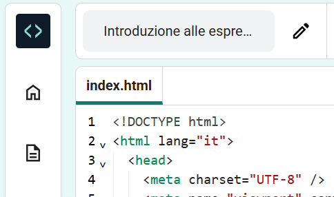

## Personalizza la tua pagina

Hai usato HTML per aggiungere dei tag alla tua pagina web.

Adesso è il momento di usare CSS per aggiungere stili alla tua pagina.

Questo passaggio ti mostra come cambiare i colori, i font e il layout nella tua pagina web.

<iframe src="https://editor.raspberrypi.org/it-IT/embed/viewer/anime-expressions-step-4" width="500" height="400" frameborder="0" marginwidth="0" marginheight="0" allowfullscreen> </iframe>

**Cascading Style Sheets (CSS)** è il linguaggio che si usa per dire al browser web come dovrebbe apparire esattamente la tua pagina web, che include i posizionamenti, i colori e i font. Questo lo chiamiamo stile.

Ogni **regola** in CSS è composta da due parti: il **selettore** e la **dichiarazione**.

Il **selettore** è la parte di HTML che vuoi stilizzare. In questo esempio è `h1`.

  <pre>h1 {
  color: blue;
  font-size: 12px;
}</pre>

 

La **dichiarazione** si inserisce tra le parentesi graffe `{}`. Fornisce le istruzioni degli stili da utilizzare.

<pre>h1 {
  color: blue;
  font-size: 12px;
}</pre>

 

### Collega il file CSS

Il progetto di partenza include i file CSS, che contengono una serie di regole utili.

--- task ---

Espandi la sezione `<head>` del tuo codice così puoi vedere il codice all'interno.

--- /task ---

--- task ---

In fondo alla tua sezione `<head></head>`, ci sono dei link a due fogli di stile CSS che sono attualmente commentati in modo da essere ignorati dal browser.

Rimuovi le frecce `<!--` e `-->` dall'inizio e dalla fine di entrambe le righe di codice del link:

**Prima**

--- code ---
---
language: html
filename: index.html
line_numbers: true
line_number_start: 21
line_highlights: 23-24
---   
    <!-- Includi il file di stile CSS -->

    <!-- <link href="style.css" rel="stylesheet" type="text/css" /> -->
    <!-- <link href="candy.css" rel="stylesheet" type="text/css" /> -->
  </head>

--- /code ---

**Dopo**

--- code ---
---
language: html
filename: index.html
line_numbers: true
line_number_start: 21
line_highlights: 23-24
---   
    <!-- Includi il file di stile CSS -->

    <link href="style.css" rel="stylesheet" type="text/css" />
    <link href="candy.css" rel="stylesheet" type="text/css" />
  </head>

--- /code ---
--- /task ---

--- task ---

**Test:** Clicca sul pulsante **Esegui**.

Gli elementi HTML hanno degli stili predefiniti che hai visto mentre scrivevi il tuo codice HTML.

Dai un'occhiata alla tua pagina web nel riquadro di destra. Puoi notare che gli stili e il layout del tuo risultato ora sono cambiati.

**Suggerimento:** Per comprimere la sezione `<head>` dopo aver visto il cambiamento, clicca sulla freccia a fianco.

--- /task ---

--- task ---

Clicca sull'icona `File del progetto` nell'editor di codice poi seleziona il file `style.css` per aprirlo in una nuova scheda.

Questo file CSS contiene tutto il CSS per il tuo progetto. Scoprirai alcune parti chiave di questo file CSS mentre crei la tua pagina web.

Quando aggiungi uno stile CSS a un **elemento**, quello stile viene applicato a ogni singolo elemento nella pagina che possiede lo stesso tag.

**Trova:** Scorri verso il basso e trova la regola che controlla lo stile di `<h2>`.

--- code ---
---
language: css
filename: style.css
line_numbers: true
line_number_start: 109
line_highlights: 109-113
---  

h2 {
  font: var(--title-font); /* Stile carattere memorizzato nella variabile title-font */
  text-align: left; /* Allinea il testo */
  padding: 1.5rem; /* Aggiungi dello spazio tutto intorno all'intestazione */
}

--- /code ---

Questa regola stabilisce quale font dovrebbe essere usato, come dovrebbe essere allineato il testo, e quanto spazio dovrebbe esserci attorno all'intestazione.

--- /task ---

--- task ---

Al momento, l'intestazione `<h2>` è allineata a sinistra.

Modifica la proprietà `text-align` della regola `h2` impostandola su `center`.

--- code ---
---
language: css
filename: style.css
line_numbers: true
line_number_start: 109
line_highlights: 111
---  

h2 {
  font: var(--title-font); /* Stile carattere memorizzato nella variabile title-font */
  text-align: center; /* Allinea il testo */
  padding: 1.5rem; /* Aggiungi dello spazio tutto intorno all'intestazione */
}

--- /code ---

--- /task ---

--- task ---

**Test:** Clicca sul pulsante **Esegui**.

Osserva la tua pagina web e assicurati che il titolo 'Espressioni facciali' sia centrato.

**Debug:** Controlla lo spelling della parola `center`. HTML utilizza lo spelling dell'inglese americano (US).

<iframe src="https://editor.raspberrypi.org/it-IT/embed/viewer/anime-expressions-step-4" width="500" height="750" frameborder="0" marginwidth="0" marginheight="0" allowfullscreen> </iframe>

--- /task ---

