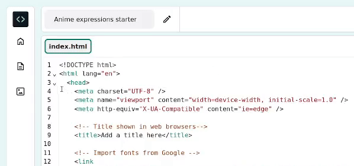
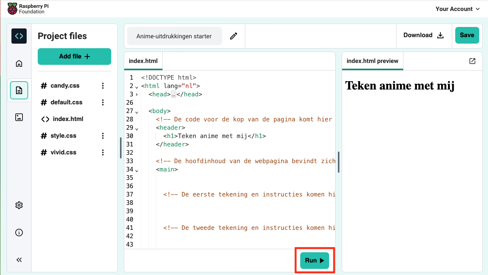

## Start je webpagina

<div style="display: flex; flex-wrap: wrap">
<div style="flex-basis: 200px; flex-grow: 1; margin-right: 15px;">
In deze stap voeg je een header en een inleiding toe aan je anime webpagina.
</div>
<div>
<iframe src="https://editor.raspberrypi.org/en/embed/viewer/anime-expressions-step-2" width="500" height="400" frameborder="0" marginwidth="0" marginheight="0" allowfullscreen> </iframe>
</div>
</div>

In HTML kun je woorden rechtstreeks in de code typen, zodat de woorden zonder opmaak op de webpagina verschijnen.

\--- task ---

Open het [Anime Expressions Start-project](https://editor.raspberrypi.org/en/projects/anime-expressions-starter){:target="_blank"}.

\--- /task ---

\--- task ---

Je start project bevat HTML waarover je tijdens het project meer zult leren.

Om je code leesbaarder te maken, kun je de delen ervan inklappen die je nu niet nodig hebt.

Klik op het kleine driehoekje naast regel 3 om `<head>` samen te vouwen.



\--- /task ---

### Voeg een kop toe

Meestal bestaat een webpagina uit drie delen. Een **koptekst** (header), de **hoofdinhoud** en een **voettekst**.

\--- task ---

Je kunt comments gebruiken om je code te organiseren en mensen helpen de code te begrijpen. Opmerkingen worden door de webbrowser genegeerd.

**Zoek** de opmerking `<!-- De code voor de kop van de pagina komt hier -->`.

\--- collapse ---

---

## title: Ik kan de opmerking niet vinden

Heb je per ongeluk de `<body>` of een ander gedeelte van jouw webpagina samengevouwen?

Klik op het ▸ driehoekje om de code uit te vouwen.

\--- /collapse ---

\--- /task ---

HTML-documenten bevatten **elementen**, waaronder alinea's, koppen en afbeeldingen. Een element bestaat doorgaans uit een starttag, een beetje inhoud en een afsluitende tag.

Een **tag** laat de browser weten wat voor soort element het is. Tags beginnen en eindigen met punthaken `<>`. De eindtag heeft ook een `/`.

\--- task ---

Zoek onder de opmerking de tags `<header>` en `</header>`. Alles wat je hier toevoegt verschijnt in de koptekst van je webpagina en wordt opgemaakt als kop.

\--- /task ---

Een `<h1>` tag wordt gebruikt om aan te geven dat deze inhoud de grootste header op de pagina is.

\--- task ---

Voeg `<h1></h1>` **tags** toe binnen je `<header></header>` tags.

**Tip:** Als je een starttag toevoegt, wordt de eindtag automatisch toegevoegd zodat je deze niet hoeft te typen.

## --- code ---

language: html
filename: index.html
line_numbers: true
line_number_start: 27
line_highlights: 30
--------------------------------------------------------

  <body>
    <!-- The page header code goes here -->
    <header>
      <h1></h1>
    </header>

\--- /code ---

**Tip:** Het is een goed idee om spaties toe te voegen aan het begin van regels om jouw code te laten inspringen. In HTML hoef je geen inspringingen toe te voegen om de code te laten werken, maar het maakt je code wel gemakkelijker leesbaar.

\--- /task ---

\--- task ---

Voeg de tekst `Teken anime met me` toe tussen de twee `<h1>` tags.

## --- code ---

language: html
filename: index.html
line_numbers: true
line_number_start: 27
line_highlights: 30
--------------------------------------------------------

  <body>
    <!-- The page header code goes here -->
    <header>
      <h1>Draw anime with me</h1>
    </header>

\--- /code ---

\--- /task ---

\--- task ---

**Test:** Klik op de **Run** knop.

De uitvoer verschijnt aan de rechterkant:



Je zult zien dat de tekst binnen de `<h1>` tags vetgedrukt is met een groot lettertype.

\--- /task ---

### Voeg de eerste sectie toe aan je hoofdinhoud

Alle hoofdinhoud moet tussen de tags `<main>` worden geplaatst. Op de webpagina wordt de hoofdinhoud opgesplitst in **secties**.

\--- task ---

Je webpagina heeft een introductiesectie nodig. Voeg `<section></section>` tags toe tussen de `<main>` tags.

**Tip:** Terwijl je je webpagina bouwt, zul je andere tags toevoegen in jouw sectie. Plaats je cursor tussen de `<section>` en `</section>` tag druk vervolgens op Enter op je toetsenbord om de tags over meerdere regels te splitsen.

## --- code ---

language: html
filename: index.html
line_numbers: true
line_number_start: 33
line_highlights: 35-37
-----------------------------------------------------------

```
<!-- The main content for the webpage goes between the main tags -->
<main>
  <section>

  </section>
    <!-- The first drawing and instructions go here -->  
```

\--- /code ---

\--- /task ---

\--- task ---

Je gaat nu een subtitel toevoegen binnen het gedeelte dat je zojuist hebt gemaakt.

Voeg de tussenkop tags `<h2>` tussen de `<section>` tags toe.

## --- code ---

language: html
filename: index.html
line_numbers: true
line_number_start: 33
line_highlights: 36
--------------------------------------------------------

```
<!-- The main content for the webpage goes between the main tags -->
<main>
  <section>
    <h2></h2>
  </section>
    <!-- The first drawing and instructions go here --> 
```

\--- /code ---

\--- /task ---

\--- task ---

Voer nu de subkop tekst `Gezichtsuitdrukkingen` in tussen de `<h2>` tags. Je code zou er als volgt uit moeten zien:

## --- code ---

language: html
filename: index.html
line_numbers: true
line_number_start: 33
line_highlights: 36
--------------------------------------------------------

```
<!-- The main content for the webpage goes between the main tags -->
<main>
  <section>
    <h2>Facial expressions</h2>
  </section>
    <!-- The first drawing and instructions go here --> 
```

\--- /code ---

\--- /task ---

\--- task ---

**Test:** Klik op de **Run** knop.

Je zult zien dat de tekst op jouw webpagina iets kleiner is dan de grote kop van boven en vette styling heeft. Dit komt omdat `<h2>` een kleinere kop is dan `<h1>`.

\--- /task ---

\--- task ---

Je gaat nu een alinea tekst toevoegen als inleiding op jouw anime webpagina.

Onder je `<h2>` kopcode valt, voeg de alinea `<p>` tags toe.

## --- code ---

language: html
filename: index.html
line_numbers: true
line_number_start: 33
line_highlights: 37
--------------------------------------------------------

```
<!-- The main content for the webpage goes between the main tags -->
<main>
  <section>
    <h2>Facial expressions</h2>
    <p></p>
  </section>
    <!-- The first drawing and instructions go here --> 
```

\--- /code ---

\--- /task ---

\--- task ---

Tussen de `<p>` tags moet je in deze inleidende tekst het volgende toevoegen:

`Kijk eens naar deze gezichtsuitdrukkingen en probeer ze in je eigen tekeningen.`

**Tip:** Je kunt de tekst hierboven markeren en vervolgens met de rechtermuisknop (tik en houd vast op mobiel) en kies 'Kopiëren'. Klik vervolgens tussen de `<p>` tags in je code en klik met de rechtermuisknop en kies 'Plakken'.

Je code zou er als volgt uit moeten zien:

## --- code ---

language: html
filename: index.html
line_numbers: true
line_number_start: 33
line_highlights: 37
--------------------------------------------------------

```
<!-- The main content for the webpage goes between the main tags -->
<main>
  <section>
    <h2>Facial expressions</h2>
    <p>Take a look at these facial expressions and try them in your own drawings.</p>
  </section>
    <!-- The first drawing and instructions go here --> 
```

\--- /code ---

\--- /task ---

\--- task ---

**Test:** Klik op de **Run** knop.

De tekst verschijnt onder de subkop en gebruikt de standaard alineastijl.

Goed gedaan! Je pagina heeft nu een kop, een subkop en een inleidende paragraaf.

<div>
<iframe src="https://editor.raspberrypi.org/en/embed/viewer/anime-expressions-step-2" width="500" height="400" frameborder="0" marginwidth="0" marginheight="0" allowfullscreen> </iframe>
</div>

\--- /task ---

## Sla je project op

Je project wordt automatisch opgeslagen. Ga terug naar de starter link in dezelfde webbrowser om je wijzigingen te zien.

\--- collapse ---

---

## title: Ik heb per ongeluk mijn project gesloten

Klik op de [startproject](https://editor.raspberrypi.org/en/projects/anime-expressions-starter){:target="_blank"} link om je project te openen. Gebruik dezelfde webbrowser om je wijzigingen te zien.

\--- /collapse ---

\--- collapse ---

---

## title: Als je een Code Editor account hebt

Klik op de 'Opslaan' knop om een kopie van het project te maken in je Raspberry Pi-account.

\--- /collapse ---
