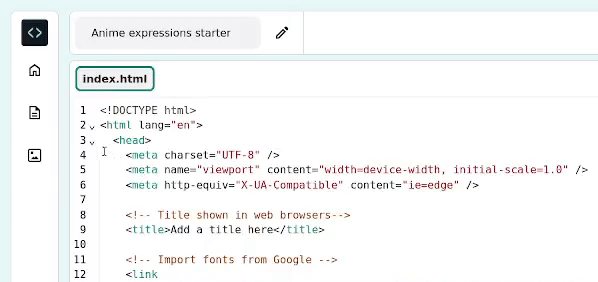
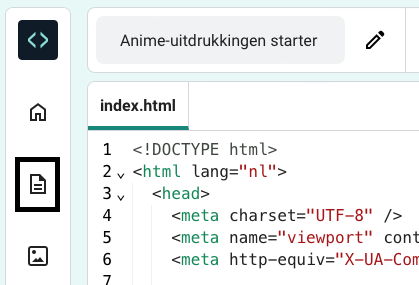
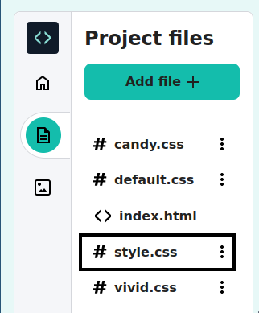

## Style je pagina

<div style="display: flex; flex-wrap: wrap">
<div style="flex-basis: 200px; flex-grow: 1; margin-right: 15px;">

Je hebt HTML gebruikt om tags aan je webpagina toe te voegen.

Nu is het tijd om CSS te gebruiken om verschillende stijlen aan je pagina toe te voegen.

Deze stap laat je zien hoe je de kleuren, lettertypen en lay-out op je webpagina kunt wijzigen.

</div>
<div>
<iframe src="https://editor.raspberrypi.org/en/embed/viewer/anime-expressions-step-4" width="500" height="400" frameborder="0" marginwidth="0" marginheight="0" allowfullscreen> </iframe>
</div>
</div>

<p style="border-left: solid; border-width:10px; border-color: #0faeb0; background-color: aliceblue; padding: 10px;">
<span style="color: #0faeb0">**Cascading Style Sheets (CSS)**</span> is de taal die je gebruikt om de webbrowser precies te vertellen hoe jouw webpagina eruit moet zien, zoals bijvoorbeeld de positionering, kleuren en lettertypen. Wij noemen dit de stijl.
</p>

Elke **regel** in CSS bestaat uit twee delen: de **selector** en de **verklaring (declaration)**.

De **selector** is het deel van HTML dat je wilt opmaken. In dit voorbeeld is het `h1`.

<div style="background-color:#2d2d2d; padding: 1em;">
  <pre><span style="color:#000; background-color:#d2d2d2; font-family: Consolas, Monaco, 'Andale Mono', 'Ubuntu Mono', monospace; font-size: 1em">h1 </span
  ><span style=" color:#ccc;  font-family: Consolas, Monaco, 'Andale Mono', 'Ubuntu Mono', monospace; font-size: 1em">{
  color: blue;
  font-size: 12px;
}</span></pre>
</div>
<br/>

De **declaration** staat tussen accolades `{}`. Het geeft instructies over de stijlen die gebruikt moeten worden.

<div style="background-color:#2d2d2d; padding: 1em;">
<pre><span style="color:#ccc; font-family: Consolas, Monaco, 'Andale Mono', 'Ubuntu Mono', monospace; font-size: 1em">h1 </span
><span style=" color:#000; background-color:#d2d2d2; font-family: Consolas, Monaco, 'Andale Mono', 'Ubuntu Mono', monospace; font-size: 1em">{
  color: blue;
  font-size: 12px;
}</span></pre>
</div>
<br/>

### Koppel het CSS-bestand

Het startersproject bevat CSS-bestanden, die een reeks nuttige regels bevatten.

\--- task ---

Onvouw de `<head>` sectie van je code zodat je de code erin kunt zien.



\--- /task ---

\--- task ---

Aan de onderkant van je `<head></head>` sectie, staan links naar twee CSS-style sheets die momenteel aangemerkt zijn als comments zodat ze worden genegeerd door de webbrowser.

Verwijder de `<!--` en `-->` pijlen uit het begin en einde van beide regels link code:

**Voor**

## --- code ---

language: html
filename: index.html
line_numbers: true
line_number_start: 21
line_highlights: 23-24
-----------------------------------------------------------

```
<!-- Voeg de CSS style file toe -->

<!-- <link href="style.css" rel="stylesheet" type="text/css" /> -->
<!-- <link href="candy.css" rel="stylesheet" type="text/css" /> -->
```

  </head>

\--- /code ---

**Na**

## --- code ---

language: html
filename: index.html
line_numbers: true
line_number_start: 21
line_highlights: 23-24
-----------------------------------------------------------

```
<!-- Voeg de CSS style file toe -->

<!-- <link href="style.css" rel="stylesheet" type="text/css" /> -->
<!-- <link href="candy.css" rel="stylesheet" type="text/css" />
```

  </head>

\--- /code ---
\--- /task ---

\--- task ---

**Test:** Klik op de **Run** knop.

HTML-elementen hebben standaard browserstijlen die je hebt gezien toen je je HTML-code hebt geschreven.

Neem een kijkje op je webpagina in het rechterpaneel. Je zult zien dat de stijlen en lay-out van je uitvoer nu veranderd zijn.

**Tip:** Om de sectie `<head>` samen te vouwen nadat je de wijziging hebt gezien, klik je op de pijl ernaast.

\--- /task ---

\--- task ---

Klik op het pictogram 'Project files' in de Code Editor en selecteer dan het 'style.css'-bestand bovenaan in een nieuw tabblad.





Dit CSS-bestand bevat alle CSS voor je project. Terwijl je jouw webpagina maakt, leer je enkele belangrijke onderdelen van dit CSS-bestand kennen.

Wanneer je CSS-styling aan een **element** toevoegt, wordt die styling toegepast op elk element op de pagina dat dezelfde tag heeft.

**Zoeken:** Scroll naar beneden en zoek de regel die de stijl van de `<h2> ` bepaalt.

## --- code ---

language: css
filename: style.css
line_numbers: true
line_number_start: 109
line_highlights: 109-113
-------------------------------------------------------------

h2 {
font: var(--title-font); /\* Font style stored in the title-font variable _/
text-align: left; /_ Align the text _/
padding: 1.5rem; /_ Add some space all around the heading \*/
}

\--- /code ---

Deze regel bepaalt welk lettertype gebruikt moet worden, hoe de tekst moet worden aangepast en hoeveel ruimte zich rond de koptekst moet bevinden.

\--- /task ---

\--- task ---

Op dit moment is de kop `<h2>` links uitgelijnd.

Verander de `text-align` eigenschap van de `h2` regel naar `center`.

## --- code ---

language: css
filename: style.css
line_numbers: true
line_number_start: 109
line_highlights: 111
---------------------------------------------------------

h2 {
font: var(--title-font); /\* Font style stored in the title-font variable _/
text-align: center; /_ Align the text _/
padding: 1.5rem; /_ Add some space all around the heading \*/
}

\--- /code ---

\--- /task ---

\--- task ---

**Test:** Klik op de **Run** knop.

Check je webpagina om te controleren dat de tekst 'Gezichtsuitdrukkingen' gecentreerd is.

**Fouten opsporen:** Controleer de spelling van het woord `center`. HTML gebruikt Amerikaans (US) Engelse spelling.

<iframe src="https://editor.raspberrypi.org/en/embed/viewer/anime-expressions-step-4" width="500" height="750" frameborder="0" marginwidth="0" marginheight="0" allowfullscreen> </iframe>

\--- /task ---

