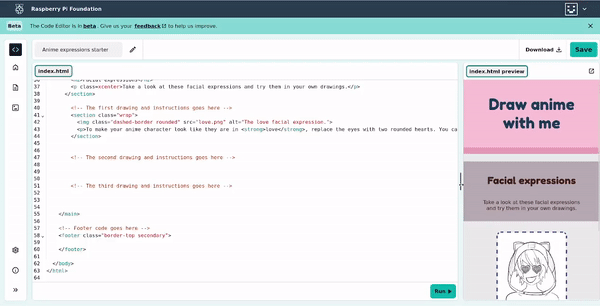

## Style met classes

Deze stap laat je zien hoe je classes toevoegt om de stijlen op je pagina aan te passen.

<iframe src="https://editor.raspberrypi.org/nl-NL/embed/viewer/anime-expressions-step-5" width="500" height="400" frameborder="0" marginwidth="0" marginheight="0" allowfullscreen> </iframe>

Als je opmaak wilt toepassen op specifieke elementen, kun je een **class** maken in een CSS-bestand. Je kunt vervolgens een `class=` **attribuut** toevoegen aan een element in je HTML-code om de browser te laten weten welke styling moet worden toegepast.

De class styling overschrijft elke styling van element die al is toegepast. Merk op dat de wijzigingen plaatsvinden terwijl je de classes aan je code toevoegt.

--- task ---

Je CSS bestand heeft een aangepaste CSS class genaamd `border-bottom`. Deze klasse voegt een dikke, ingekleurde rand toe aan de onderkant van elk HTML-element dat het gebruikt.

Ga naar je `index.html` bestand en zoek je `header`.

Voeg `class="border-bottom"` toe na het woord `header` in je `header` tag.

--- code ---
---
language: html
filename: index.html
line_numbers: true
line_number_start: 27
line_highlights: 29
---
  <body>
    <!-- De code voor de kop van de pagina komt hier -->
    <header class="border-bottom">
      <h1>Teken anime met mij</h1>
    </header>

--- /code ---

--- /task ---

--- task ---

Voeg de `border-top` class toe aan je `footer` code om een dikke rand toe te passen aan de top van je voettekst.

--- code ---
---
language: html
filename: index.html
line_numbers: true
line_number_start: 55
line_highlights: 56
---
    <!-- Webpagina voettekst -->
    <footer class="border-top">

--- /code ---

--- /task ---

De `primary` class stelt een contrasterende achtergrond en tekstkleur in voor het grootste deel van de hoofdinhoud.

De `secondary' class stelt een extra kleur combinatie in die goed past bij de kleuren van de`primary\` class.

--- task ---

Voeg de 'secondary' class toe aan je `footer` code om een andere kleur achtergrond aan je voettekst te geven.

--- code ---
---
language: html
filename: index.html
line_numbers: true
line_number_start: 55
line_highlights: 56
---
    <!-- Webpagina voettekst -->
    <footer class="border-top secondary">

--- /code ---

--- /task ---

--- task ---

Voeg `class="primary"` toe aan `<main>`.

--- code ---
---
language: html
filename: index.html
line_numbers: true
line_number_start: 33
line_highlights: 34
---
    <!-- De hoofdinhoud van de webpagina bevindt zich tussen de hoofdtags -->
    <main class="primary">

--- /code ---

--- /task ---

--- task ---

Voeg `secondary` toe aan `<header>`.

--- code ---
---
language: html
filename: index.html
line_numbers: true
line_number_start: 28
line_highlights: 29
---
    <!-- De code voor de kop van de pagina komt hier -->
    <header class="border-bottom secondary">

--- /code ---

--- /task ---

De `tertiary` class stelt een extra kleur combinatie goed combineert met de kleuren in de `primary` en `secundary` classes.

--- task ---

Voeg `class="tertiary"` toe aan het **eerste** `<section>` element.

--- code ---
---
language: html
filename: index.html
line_numbers: true
line_number_start: 33
line_highlights: 35
---
    <!-- De hoofdinhoud van de webpagina bevindt zich tussen de hoofdtags -->
    <main class="primary">
      <section class="tertiary">
        <h2>Gezichtsuitdrukkingen</h2>
        
Kijk eens naar deze gezichtsuitdrukkingen en probeer ze in je eigen tekeningen.

      </section>

--- /code ---

De class `xcenter` in je CSS-bestand lijnt items horizontaal uit over de pagina.

--- /task ---

--- task ---

Voeg `class="xcenter"` toe aan de `
` in dezelfde sectie.

--- code ---
---
language: html
filename: index.html
line_numbers: true
line_number_start: 33
line_highlights: 37
---
    <!-- De hoofdinhoud van de webpagina bevindt zich tussen de hoofdtags -->
    <main class="primary">
      <section class="tertiary">
        <h2>Gezichtsuitdrukkingen</h2>
        
Kijk eens naar deze gezichtsuitdrukkingen en probeer ze in je eigen tekeningen.

      </section>

--- /code ---

--- /task ---

Webpagina's kunnen op veel verschillende apparaten worden bekeken en moeten **responsive** zijn voor elk apparaat. Dit betekent dat als een gebruiker jouw pagina op een mobiele telefoon bekijkt, het moet reageren op een kleiner scherm en als ze het op een bureaublad bekijken, moet het op een groter scherm reageren. 

CSS kan de lay-out op een webpagina veranderen, die ook wordt gebruikt om kleuren, lettertypen en randen te veranderen.

--- task ---

Zoek de **tweede** `<section>`.

Voeg `class="wrap"` toe aan de `<section>` tag.

--- code ---
---
language: html
filename: index.html
line_numbers: true
line_number_start: 39
line_highlights: 40
---
    <!-- Plaats de eerste tekening en instructies hier -->
    <section class="wrap">
      
      
Om je anime-personage eruit te laten zien alsof hij of zij <strong>verliefd</strong> is, vervang je de ogen door twee ronde harten. Je kunt nog drie harten toevoegen voor een leuk effect.

    </section>

--- /code ---

--- /task ---

Je kunt ook gekleurde randen toevoegen in verschillende stijlen aan HTML elementen. De `dashed-border` class in het stijlbestand maakt een stippellijn.

--- task ---

Voeg de `dashed-border` class toe aan de ``.

--- code ---
---
language: html
filename: index.html
line_numbers: true
line_number_start: 39
line_highlights: 41
---
    <!-- Plaats de eerste tekening en instructies hier -->
    <section class="wrap">
      
      
Om je anime-personage eruit te laten zien alsof hij of zij <strong>verliefd</strong> is, vervang je de ogen door twee ronde harten. Je kunt nog drie harten toevoegen voor een leuk effect.

    </section>

--- /code ---

--- /task ---

Je kunt de hoeken van een element afgerond maken met de 'rounded' class.

--- task ---

Voeg de `rounded` class toe aan de ``.

--- code ---
---
language: html
filename: index.html
line_numbers: true
line_number_start: 39
line_highlights: 41
---
    <!-- Plaats de eerste tekening en instructies hier -->
    <section class="wrap">
      
      
Om je anime-personage eruit te laten zien alsof hij of zij <strong>verliefd</strong> is, vervang je de ogen door twee ronde harten. Je kunt nog drie harten toevoegen voor een leuk effect.

    </section>

--- /code ---

--- /task ---

--- task ---

**Test:** Klik op de **Run** knop.

Sleep de balk tussen de teksteditor en je webpagina om de webpagina smaller te maken.

De tekst moet onder de afbeelding bewegen. Dit is de lay-out voor gebruikers die de webpagina op een mobiele telefoon bekijken.

Sleep de balk terug na het testen, zodat je de afbeelding en tekst naast elkaar kunt zien.

--- /task ---
