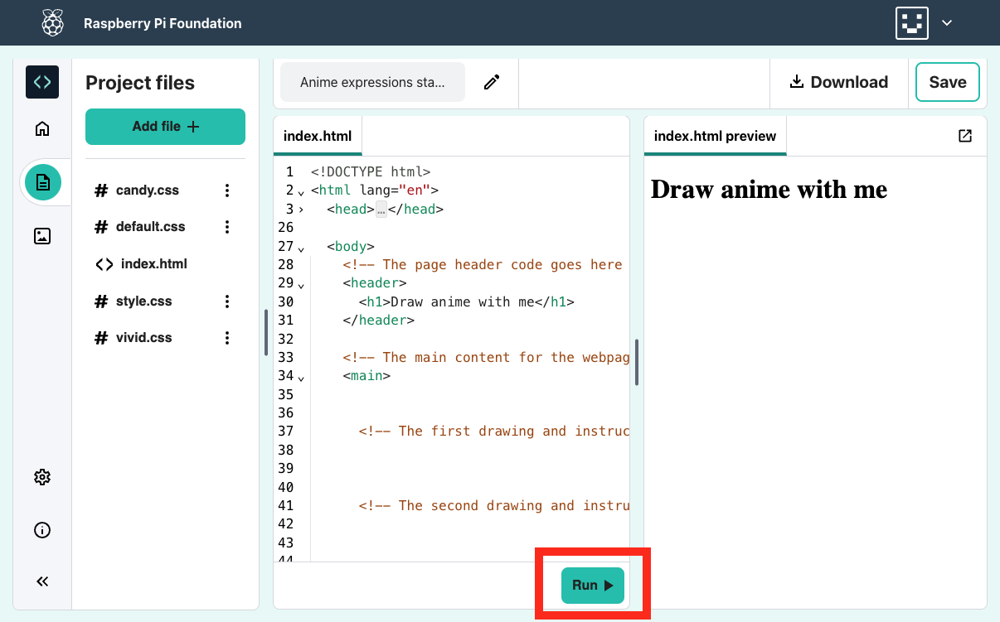

## Uruchom swoją stronę internetową

<div style="display: flex; flex-wrap: wrap">
<div style="flex-basis: 200px; flex-grow: 1; margin-right: 15px;">
W tym kroku dodasz nagłówek i wprowadzenie do swojej strony anime.
</div>
<div>
<iframe src="https://editor.raspberrypi.org/en/embed/viewer/anime-expressions-step-2" width="500" height="400" frameborder="0" marginwidth="0" marginheight="0" allowfullscreen> </iframe>
</div>
</div>

W HTML możesz wpisywać słowa bezpośrednio do kodu, aby słowa były wyświetlane, niesformatowane, na stronie internetowej.

\--- task ---

Otwórz [projekt startowy wyrażeń anime](https://editor.raspberrypi.org/en/projects/anime-expressions-starter){:target="_blank"}.

\--- /task ---

\--- task ---

Twój projekt startowy zawiera trochę kodu HTML, o którym dowiesz się więcej w całym projekcie.

Aby ułatwić odczytanie kodu, możesz zwinąć jego części, których teraz nie potrzebujesz.

Kliknij mały trójkąt obok linii 3, aby zwinąć „<head>”.


\--- /task ---

### Dodaj nagłówek

Zazwyczaj strona internetowa składa się z trzech części. A **nagłówek**, **główna** zawartość i **stopka**.

\--- task ---

Możesz użyć komentarzy, aby uporządkować swój kod i pomóc ludziom zrozumieć kod. Komentarze są ignorowane przez przeglądarkę internetową.

**Znajdź** komentarz "<!-- Kod nagłówka strony idzie tutaj -->".

\--- collapse ---

---

## Title: Nie mogę znaleźć komentarza

Czy przypadkowo zwinąłeś „<body>” lub inną sekcję swojej strony internetowej?

Kliknij trójkąt ▸ , aby rozwinąć kod.

\--- /collapse ---

\--- /task ---

Dokumenty HTML zawierają **elementy**, w tym akapity, nagłówki i obrazy. Element składa się zazwyczaj z znacznika początkowego, pewnej zawartości i tagu zamykającego.

**Tag** informuje przeglądarkę o rodzaju elementu. Znaczniki zaczynają się i kończą z nawiasami kątowymi "<>". Znacznik końcowy ma również "/".

\--- task ---

Pod komentarzem znajdź znaczniki „<header>” i „</header>”. Wszystko, co tutaj dodasz, pojawia się w nagłówku twojej strony internetowej i jest stylizowane jako nagłówek.

\--- /task ---

Tag „<h1>” jest używany do powiedzenia, że ta zawartość jest największym nagłówkiem na stronie.

\--- task ---

Dodaj znaczniki „<h1> </h1>” **tagi** wewnątrz znaczników „<header> </header>”.

**Wskazówka:** po dodaniu znacznika startowego znacznik końcowy jest automatycznie dodawany, więc nie musisz go wpisywać.

## --- code ---

language: html
filename: index.html
line_numbers: true
line_number_start: 27
line_highlights: 30
--------------------------------------------------------

  <body>
    <!-- The page header code goes here -->
    <header>
      <h1></h1>
    </header>

\--- /code ---

**Wskazówka:** dobrze jest dodać spacje na początku linii, aby wcięcie kodu. W HTML nie musisz dodawać wcięć, aby kod działał, ale ułatwia odczytanie kodu.

\--- /task ---

\--- task ---

Dodaj tekst "Rysuj anime ze mną" pomiędzy dwoma znacznikami "<h1>".

## --- code ---

language: html
filename: index.html
line_numbers: true
line_number_start: 27
line_highlights: 30
--------------------------------------------------------

  <body>
    <!-- The page header code goes here -->
    <header>
      <h1>Draw anime with me</h1>
    </header>

\--- /code ---

\--- /task ---

\--- task ---

**Test:** Kliknij przycisk **Run**.

Wynik pojawi się po prawej stronie:



Zobaczysz, że tekst wewnątrz znaczników „<h1>” jest wystylizowany jako pogrubiony z dużą czcionką.

\--- /task ---

### Dodaj pierwszą sekcję w swojej głównej treści

Każda główna zawartość powinna być umieszczona między znacznikami „<main>”. Na Twojej stronie główna zawartość jest podzielona na **sekcje**.

\--- task ---

Twoja strona internetowa potrzebuje sekcji wprowadzającej. Dodaj znaczniki „<section> </section>” pomiędzy znacznikami „<main>”.

**Wskazówka:** podczas tworzenia strony internetowej dodasz inne tagi do swojej sekcji. Umieść kursor pomiędzy znacznikami „<section>” i „</section>”, a następnie naciśnij klawisz Enter na klawiaturze, aby podzielić znaczniki na wiele linii.

## --- code ---

language: html
filename: index.html
line_numbers: true
line_number_start: 33
line_highlights: 35-37
-----------------------------------------------------------

```
<!-- The main content for the webpage goes between the main tags -->
<main>
  <section>

  </section>
    <!-- The first drawing and instructions go here -->  
```

\--- /code ---

\--- /task ---

\--- task ---

Teraz dodasz podpozycję w sekcji, którą właśnie stworzyłeś.

Dodaj znaczniki podpozycji „<h2>” pomiędzy znacznikami „<section>”.

## --- code ---

language: html
filename: index.html
line_numbers: true
line_number_start: 33
line_highlights: 36
--------------------------------------------------------

```
<!-- The main content for the webpage goes between the main tags -->
<main>
  <section>
    <h2></h2>
  </section>
    <!-- The first drawing and instructions go here --> 
```

\--- /code ---

\--- /task ---

\--- task ---

Teraz wpisz tekst podpozycji „Wyrazy twarzy” pomiędzy znacznikami „<h2>”. Twój kod powinien wyglądać tak:

## --- code ---

language: html
filename: index.html
line_numbers: true
line_number_start: 33
line_highlights: 36
--------------------------------------------------------

```
<!-- The main content for the webpage goes between the main tags -->
<main>
  <section>
    <h2>Facial expressions</h2>
  </section>
    <!-- The first drawing and instructions go here --> 
```

\--- /code ---

\--- /task ---

\--- task ---

**Test:** Kliknij przycisk **Run**.

Zauważ, że tekst na twojej stronie jest nieco mniejszy niż duży nagłówek powyżej i ma odważną stylistykę. Dzieje się tak dlatego, że "<h2>" jest mniejszym nagłówkiem niż "<h1>".

\--- /task ---

\--- task ---

Teraz dodasz akapit tekstu jako wprowadzenie do swojej strony anime.

Pod kodem nagłówka „<h2>” dodaj znaczniki akapit „<p>”.

## --- code ---

language: html
filename: index.html
line_numbers: true
line_number_start: 33
line_highlights: 37
--------------------------------------------------------

```
<!-- The main content for the webpage goes between the main tags -->
<main>
  <section>
    <h2>Facial expressions</h2>
    <p></p>
  </section>
    <!-- The first drawing and instructions go here --> 
```

\--- /code ---

\--- /task ---

\--- task ---

Pomiędzy znacznikami "<p>" musisz dodać w tym tekście wprowadzającym:

"Spójrz na te mimimiki i wypróbuj je we własnych rysunkach.

**Wskazówka:** Możesz podświetlić powyższy tekst, a następnie kliknąć prawym przyciskiem myszy (dotknij i przytrzymaj na telefonie komórkowym) i wybrać „Kopiuj”. Następnie kliknij pomiędzy znacznikami „<p>” w swoim kodzie, a następnie kliknij prawym przyciskiem myszy i wybierz „Wklej”.

Twój kod powinien wyglądać tak:

## --- code ---

language: html
filename: index.html
line_numbers: true
line_number_start: 33
line_highlights: 37
--------------------------------------------------------

```
<!-- The main content for the webpage goes between the main tags -->
<main>
  <section>
    <h2>Facial expressions</h2>
    <p>Take a look at these facial expressions and try them in your own drawings.</p>
  </section>
    <!-- The first drawing and instructions go here --> 
```

\--- /code ---

\--- /task ---

\--- task ---

**Test:** Kliknij przycisk **Run**.

Tekst pojawia się pod podpozycją i używa domyślnej stylizacji akapitów.

Dobra robota! Twoja strona ma teraz nagłówek, podtytuł i akapit wprowadzający.

<div>
<iframe src="https://editor.raspberrypi.org/en/embed/viewer/anime-expressions-step-2" width="500" height="400" frameborder="0" marginwidth="0" marginheight="0" allowfullscreen> </iframe>
</div>

\--- /task ---

## Zapisz swój projekt

Twój projekt zostanie zapisany automatycznie. Wróć do linku startowego w tej samej przeglądarce internetowej, aby zobaczyć swoje zmiany.

\--- collapse ---

---

## Title: Przypadkowo zamknąłem swój projekt

Kliknij link [projekt startowy](https://editor.raspberrypi.org/en/projects/anime-expressions-starter){:target="_blank"}, aby otworzyć swój projekt. Użyj tej samej przeglądarki internetowej, aby zobaczyć swoje zmiany.

\--- /collapse ---

\--- collapse ---

---

## Title: Jeśli masz konto Edytora kodu

Kliknij przycisk „Zapisz”, aby utworzyć kopię projektu na swoim koncie Raspberry Pi.

\--- /collapse ---
