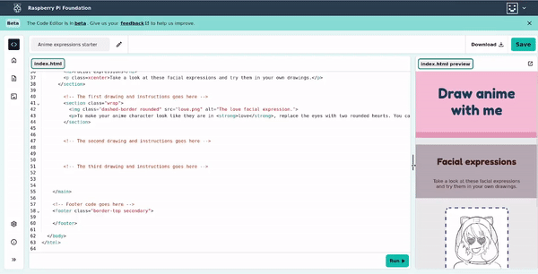

## Styl z klasami

<div style="display: flex; flex-wrap: wrap">
<div style="flex-basis: 200px; flex-grow: 1; margin-right: 15px;">

Ten krok pokazuje, jak dodać klasy, aby dostosować style na swojej stronie.

</div>
<div>
<iframe src="https://editor.raspberrypi.org/en/embed/viewer/anime-expressions-step-5" width="500" height="400" frameborder="0" marginwidth="0" marginheight="0" allowfullscreen> </iframe>
</div>
</div>

Jeśli chcesz zastosować styl do określonych elementów, możesz utworzyć **class** w pliku CSS. Następnie możesz dodać atrybut "class=" \*\*do elementu w swoim kodzie HTML, aby poinformować przeglądarkę, jaką stylizację należy zastosować.

Stylizacja klasy zastępuje wszystkie elementy, które zostały już zastosowane. Zauważ, że zmiany mają miejsce, gdy dodasz klasy do swojego kodu.

\--- task ---

Twój plik CSS ma niestandardową klasę CSS o nazwie "border-bottom". Ta klasa dodaje grubą, jednolitą ramkę linii na dole dowolnego elementu HTML, który go używa.

Przejdź do pliku „index.html” i znajdź swój „nagłówek”.

Dodaj "class="border-bottom"" po słowie "header" w znaczniku "header".

## --- code ---

language: html
filename: index.html
line_numbers: true
line_number_start: 27
line_highlights: 29
--------------------------------------------------------

  <body>
    <!-- The page header code goes here -->
    <header class="border-bottom">
      <h1>Draw anime with me</h1>
    </header>

\--- /code ---

\--- /task ---

\--- task ---

Dodaj klasę "border-top" do kodu "stopki", aby nałożyć grubą ramkę na górną część stopki.

## --- code ---

language: html
filename: index.html
line_numbers: true
line_number_start: 55
line_highlights: 56
--------------------------------------------------------

```
<!-- Webpage footer -->
<footer class="border-top">
```

\--- /code ---

\--- /task ---

Klasa "primary" ustawia kontrastujące tło i kolor tekstu dla większości głównej zawartości.

Klasa "drugorzędna" ustawia dodatkową kombinację kolorów, która dobrze wygląda z kolorami w klasie "primary".

\--- task ---

Dodaj klasę "drugorzędną" do kodu "stopki", aby zastosować do stopki inne kolorowe tło.

## --- code ---

language: html
filename: index.html
line_numbers: true
line_number_start: 55
line_highlights: 56
--------------------------------------------------------

```
<!-- Webpage footer -->
<footer class="border-top secondary">
```

\--- /code ---

\--- /task ---

\--- task ---

Dodaj "class="primary" do "<main>".

## --- code ---

language: html
filename: index.html
line_numbers: true
line_number_start: 33
line_highlights: 34
--------------------------------------------------------

```
<!-- The main content for the webpage goes between the main tags -->
<main class="primary">
```

\--- /code ---

\--- /task ---

\--- task ---

Dodaj "drugorzędny" do "<header>".

## --- code ---

language: html
filename: index.html
line_numbers: true
line_number_start: 28
line_highlights: 29
--------------------------------------------------------

```
<!-- The page header code goes here -->
<header class="border-bottom secondary">
```

\--- /code ---

\--- /task ---

Klasa "trzeciorzędna" ustawia dodatkową kombinację kolorów, która dobrze wygląda z kolorami w klasach "podstawowych" i "drugorzędnych".

\--- task ---

Dodaj "class="trzeciorzędny"" do **first** '<section>' element.

## --- code ---

language: html
filename: index.html
line_numbers: true
line_number_start: 33
line_highlights: 35
--------------------------------------------------------

```
<!-- The main content for the webpage goes between the main tags -->
<main class="primary">
  <section class="tertiary">
    <h2>Facial expressions</h2>
    <p class="xcenter">Take a look at these facial expressions and try them in your own drawings.</p>
  </section>
```

\--- /code ---

Klasa "xcenter" w pliku CSS wyrównuje elementy poziomo na stronie.

\--- /task ---

\--- task ---

Dodaj "class="xcenter"" do "<p>" w tej samej sekcji.

## --- code ---

language: html
filename: index.html
line_numbers: true
line_number_start: 33
line_highlights: 37
--------------------------------------------------------

```
<!-- The main content for the webpage goes between the main tags -->
<main class="primary">
  <section class="tertiary">
    <h2>Facial expressions</h2>
    <p class="xcenter">Take a look at these facial expressions and try them in your own drawings.</p>
  </section>
```

\--- /code ---

\--- /task ---

<p style="border-left: solid; border-width:10px; border-color: #0faeb0; background-color: aliceblue; padding: 10px;">
Strony internetowe można przeglądać na wielu różnych urządzeniach i powinny być <span style="color: #0faeb0">**responsywne**</span> na każde urządzenie. Oznacza to, że jeśli użytkownik wyświetli Twoją stronę na telefonie komórkowym, powinien odpowiedzieć na mniejszy ekran, a jeśli wyświetli ją na komputerze stacjonarnym, powinien reagować na większy ekran. 
</p>

CSS może zmienić układ strony internetowej, a także jest używany do zmiany kolorów, czcionek i obramowań.

\--- task ---

Znajdź **drugi** „<section>”.

Dodaj "class="wrap"" do znacznika "<section>".

## --- code ---

language: html
filename: index.html
line_numbers: true
line_number_start: 39
line_highlights: 40
--------------------------------------------------------

```
<!-- The first drawing and instructions go here -->
<section class="wrap">
  
  <p>To make your anime character look like they are in love, replace the eyes with two rounded hearts. You can add three more hearts inside for a fun effect.</p>
</section>
```

\--- /code ---

\--- /task ---

Możesz również dodać kolorowe obramowania w różnych stylach do elementów HTML. Klasa "przerywana-granica" w pliku stylu tworzy przerywaną granicę.

\--- task ---

Dodaj klasę "przerywana granica" do "".

## --- code ---

language: html
filename: index.html
line_numbers: true
line_number_start: 39
line_highlights: 41
--------------------------------------------------------

```
<!-- The first drawing and instructions go here -->
<section class="wrap">
  
  <p>To make your anime character look like they are in love, replace the eyes with two rounded hearts. You can add three more hearts inside for a fun effect.</p>
</section>
```

\--- /code ---

\--- /task ---

Możesz zaokrąglić narożniki elementu za pomocą klasy „zaokrąglone”.

\--- task ---

Dodaj klasę "zaokrąglony" do "".

## --- code ---

language: html
filename: index.html
line_numbers: true
line_number_start: 39
line_highlights: 41
--------------------------------------------------------

```
<!-- The first drawing and instructions go here -->
<section class="wrap">
  
  <p>To make your anime character look like they are in love, replace the eyes with two rounded hearts. You can add three more hearts inside for a fun effect.</p>
</section>
```

\--- /code ---

\--- /task ---

\--- task ---

**Test:** Kliknij przycisk **Run**.

Przeciągnij pasek między edytorem tekstu a stroną internetową, aby zmniejszyć jej rozmiar.

Tekst powinien znajdować się poniżej obrazu. Jest to układ dla użytkowników, którzy przeglądają stronę na telefonie komórkowym.

Przeciągnij pasek z powrotem po przetestowaniu, aby zobaczyć obraz i tekst obok siebie.



\--- /task ---
