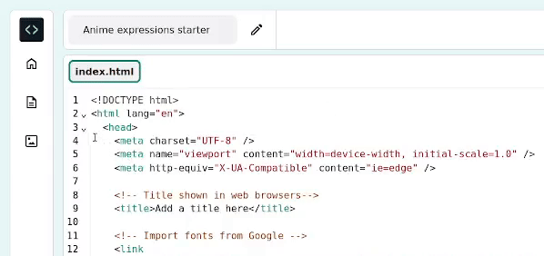
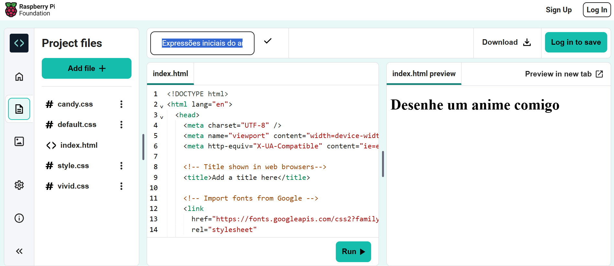

## Comece sua página Web

<div style="display: flex; flex-wrap: wrap">
<div style="flex-basis: 200px; flex-grow: 1; margin-right: 15px;">
Nesta etapa, você adicionará um cabeçalho e uma introdução à sua página Web do anime.
</div>
<div>
<iframe src="https://editor.raspberrypi.org/en/embed/viewer/anime-expressions-step-2" width="500" height="400" frameborder="0" marginwidth="0" marginheight="0" allowfullscreen> </iframe>
</div>
</div>

Em HTML, você pode digitar palavras diretamente no código para aparecer, sem formatação, na página web.

\--- task ---

Abra o [Projeto expressões iniciais do anime](https://editor.raspberrypi.org/en/projects/anime-expressions-starter){:target="_blank"}.

\--- /task ---

\--- task ---

Seu projeto inicial contém algum HTML sobre o qual você aprenderá mais ao longo do projeto.

Para facilitar a leitura do seu código, você pode fechar as partes dele que você não precisa agora.

Clique no pequeno triângulo ao lado da linha 3 para fechar `<head>`.



\--- /task ---

### Adicione um cabeçalho

Normalmente, uma página Web tem três partes. Uma **header** (cabeçalho), o **main** (conteúdo principal) e um **footer** (rodapé).

\--- task ---

Você pode usar comentários para organizar seu código e ajudar as pessoas a entendê-lo. Os comentários são ignorados pelo navegador.

**Encontre** o comentário `<!-- The page header code goes here --> `.

\--- collapse ---

---

## title: Não consigo encontrar o comentário

Você acidentalmente fechou o `<body>` ou outra seção da sua página Web?

Clique no triângulo ▸ para expandir o código.

\--- /collapse ---

\--- /task ---

Documentos HTML contêm **elementos** incluindo parágrafos, títulos e imagens. Um elemento é normalmente composto de uma tag inicial, algum conteúdo e uma tag de fechamento.

Uma **tag** permite que o navegador saiba que gênero de elemento ele é. As tags começam e terminam com colchetes angulares `<>`. A tag final também tem uma `/`.

\--- task ---

Abaixo do comentário, encontre as tags `<header>` e `</header>`. Tudo o que você adicionar aqui aparece no cabeçalho da sua página Web estilizado como um cabeçalho.

\--- /task ---

A tag `<h1>` é usada para dizer que este conteúdo é o maior cabeçalho da página.

\--- task ---

Adicione `<h1></h1>` **tags** dentro de suas tags `<header></header>`.

\*\*Dica: \*\* quando você adiciona uma tag inicial, a tag final é adicionada automaticamente, então você não precisa digitá-la.

## --- code ---

language: html
filename: index.html
line_numbers: true
line_number_start: 27
line_highlights: 30
--------------------------------------------------------

  <body>
    <!-- The page header code goes here -->
    <header>
      <h1></h1>
    </header>

\--- /code ---

**Dica:** é uma boa ideia adicionar espaços no início de linhas para endentação do seu código. Em HTML, você não precisa adicionar recuos para o código funcionar, mas isso torna seu código mais fácil de ler.

\--- /task ---

\--- task ---

Adicione o texto `Desenhe um anime comigo` entre às duas tags `<h1>`.

## --- code ---

language: html
filename: index.html
line_numbers: true
line_number_start: 27
line_highlights: 30
--------------------------------------------------------

  <body>
    <!-- The page header code goes here -->
    <header>
      <h1>Draw anime with me</h1>
    </header>

\--- /code ---

\--- /task ---

\--- task ---

**Test:** Clique no botão **Run**.

O resultado será exibido à direita:



Você verá que o texto nas tags `<h1>` está em negrito e com uma fonte grande.

\--- /task ---

### Adicione a primeira seção no seu conteúdo principal

Qualquer conteúdo principal deve ser colocado entre as tags `<main>`. Na sua página Web, o conteúdo principal é dividido em **seções**.

\--- task ---

Sua página web precisa de uma seção de introdução. Adicione as tags `<section></section>` entre as tags `<main>`.

**Dica:** Conforme você constrói sua página da web, você adicionará outras tags dentro da sua seção. Posicione o cursor entre as tags `<section>` e `</section>` e pressione Enter no teclado para dividir as tags em várias linhas.

## --- code ---

language: html
filename: index.html
line_numbers: true
line_number_start: 33
line_highlights: 35-37
-----------------------------------------------------------

```
<!-- The main content for the webpage goes between the main tags -->
<main>
  <section>

  </section>
    <!-- The first drawing and instructions go here -->  
```

\--- /code ---

\--- /task ---

\--- task ---

Agora você adicionará um subtítulo na seção que acabou de criar.

Adicione as tags de subtítulo `<h2>` entre as tags `<section>`.

## --- code ---

language: html
filename: index.html
line_numbers: true
line_number_start: 33
line_highlights: 36
--------------------------------------------------------

```
<!-- The main content for the webpage goes between the main tags -->
<main>
  <section>
    <h2></h2>
  </section>
    <!-- The first drawing and instructions go here --> 
```

\--- /code ---

\--- /task ---

\--- task ---

Agora insira o texto do subtítulo `Expressões faciais` entre as tags `<h2>`. Seu código deve ficar assim:

## --- code ---

language: html
filename: index.html
line_numbers: true
line_number_start: 33
line_highlights: 36
--------------------------------------------------------

```
<!-- The main content for the webpage goes between the main tags -->
<main>
  <section>
    <h2>Facial expressions</h2>
  </section>
    <!-- The first drawing and instructions go here --> 
```

\--- /code ---

\--- /task ---

\--- task ---

\*\*Teste: \*\* Clique no botão **Run**.

Observe como o texto na sua página Web é um pouco menor que o título grande acima e tem um estilo em negrito. Isso ocorre porque `<h2>` é um título menor que `<h1>`.

\--- /task ---

\--- task ---

Agora você adicionará um parágrafo de texto como introdução à sua página do anime.

Abaixo do código do seu título `<h2>`, adicione as tags de parágrafo `<p>`.

## --- code ---

language: html
filename: index.html
line_numbers: true
line_number_start: 33
line_highlights: 37
--------------------------------------------------------

```
<!-- The main content for the webpage goes between the main tags -->
<main>
  <section>
    <h2>Facial expressions</h2>
    <p></p>
  </section>
    <!-- The first drawing and instructions go here --> 
```

\--- /code ---

\--- /task ---

\--- task ---

Entre as tags `<p>`, você precisa adicionar este texto introdutório:

`Dê uma olhada nessas expressões faciais e tente usá-las nos seus desenhos.`

\*\*Dica: \*\* você pode destacar o texto acima e clicar com o botão direito (toque e segure no celular) e escolha 'Copiar'. Em seguida, clique entre as tags `<p>` no seu código, clique com o botão direito e escolha 'Colar'.

Seu código deve ficar assim:

## --- code ---

language: html
filename: index.html
line_numbers: true
line_number_start: 33
line_highlights: 37
--------------------------------------------------------

```
<!-- The main content for the webpage goes between the main tags -->
<main>
  <section>
    <h2>Facial expressions</h2>
    <p>Take a look at these facial expressions and try them in your own drawings.</p>
  </section>
    <!-- The first drawing and instructions go here --> 
```

\--- /code ---

\--- /task ---

\--- task ---

**Test:** Clique no botão **Run**.

O texto aparece abaixo do subtítulo e usa o estilo de parágrafo padrão.

Bom Trabalho! Sua página agora tem um cabeçalho, um subtítulo e um parágrafo introdutório.

<div>
<iframe src="https://editor.raspberrypi.org/en/embed/viewer/anime-expressions-step-2" width="500" height="400" frameborder="0" marginwidth="0" marginheight="0" allowfullscreen> </iframe>
</div>

\--- /task ---

## Salve o seu projeto

Seu projeto é salvo automaticamente. Retorne ao link inicial no mesmo navegador para ver suas alterações.

\--- collapse ---

---

## title: Fechei meu projeto acidentalmente

Clique no link [projeto inicial](https://editor.raspberrypi.org/en/projects/anime-expressions-starter){:target="_blank"} para abrir seu projeto. Use o mesmo navegador para ver suas alterações.

\--- /collapse ---

\--- collapse ---

---

## title: Se você tem uma conta do Editor de Código

Clique no botão 'Salvar' para criar uma cópia do projeto na sua conta Raspberry Pi.

\--- /collapse ---
