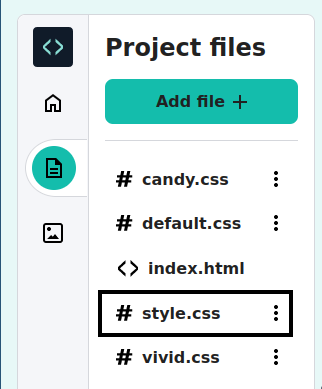

## Estilize sua página

<div style="display: flex; flex-wrap: wrap">
<div style="flex-basis: 200px; flex-grow: 1; margin-right: 15px;">

Você usou HTML para adicionar tags à sua página web.

Agora é hora de usar CSS para adicionar estilos à sua página.

Este passo mostra como mudar as cores, fontes e layout da sua página Web.

</div>
<div>
<iframe src="https://editor.raspberrypi.org/en/embed/viewer/anime-expressions-step-4" width="500" height="400" frameborder="0" marginwidth="0" marginheight="0" allowfullscreen> </iframe>
</div>
</div>

<p style="border-left: solid; border-width:10px; border-color: #0faeb0; background-color: aliceblue; padding: 10px;">
<span style="color: #0faeb0">**Folha de Estilo em Cascata(CSS)**</span> é a linguagem que você usa para informar ao navegador exatamente como sua página deve ficar, o que inclui posicionamento, cores e fontes. Nós chamamos isso de estilo.
</p>

Cada **regra** em CSS é composta de duas partes: o **seletor** e a **declaração**.

O **seletor** é a parte do HTML que você deseja estilizar. Neste exemplo é `h1`.

<div style="background-color:#2d2d2d; padding: 1em;">
  <pre><span style="color:#000; background-color:#d2d2d2; font-family: Consolas, Monaco, 'Andale Mono', 'Ubuntu Mono', monospace; font-size: 1em">h1 </span
  ><span style=" color:#ccc;  font-family: Consolas, Monaco, 'Andale Mono', 'Ubuntu Mono', monospace; font-size: 1em">{
  color: blue;
  font-size: 12px;
}</span></pre>
</div>
<br/>

A **declaração** está entre chaves `{}`. Ele dá instruções para os estilos que devem ser usados.

<div style="background-color:#2d2d2d; padding: 1em;">
<pre><span style="color:#ccc; font-family: Consolas, Monaco, 'Andale Mono', 'Ubuntu Mono', monospace; font-size: 1em">h1 </span
><span style=" color:#000; background-color:#d2d2d2; font-family: Consolas, Monaco, 'Andale Mono', 'Ubuntu Mono', monospace; font-size: 1em">{
  color: blue;
  font-size: 12px;
}</span></pre>
</div>
<br/>

### Vincule o arquivo CSS

O projeto inicial inclui arquivos CSS, que contêm um conjunto de regras úteis.

\--- task ---

Desdobre a seção \`<head> do seu código para você poder ver o código dentro dele.


\--- /task ---

\--- task ---

Na parte inferior do seu `<head></head>`, existem links para duas folhas de estilo CSS que estão atualmente comentadas para sejam ignoradas pelo navegador da web.

Remova as setas `<!--` e `-->` do início e do final das duas linhas do código de linha:

**Antes**

## --- code ---

language: html
filename: index.html
line_numbers: true
line_number_start: 21
line_highlights: 23-24
-----------------------------------------------------------

```
<!-- Inclua o arquivo CSS style -->

<!-- <link href="style.css" rel="stylesheet" type="text/css" /> -->
<!-- <link href="candy.css" rel="stylesheet" type="text/css" /> -->
```

  </head>

\--- /code ---

**Depois**

## --- code ---

language: html
filename: index.html
line_numbers: true
line_number_start: 21
line_highlights: 23-24
-----------------------------------------------------------

```
<!--  Inclua o arquivo CSS style -->

<link href="style.css" rel="stylesheet" type="text/css" />
<link href="candy.css" rel="stylesheet" type="text/css" />
```

  </head>

\--- /code ---
\--- /task ---

\--- task ---

**Teste:** Clique no botão **Run**.

Os elementos HTML têm estilos padrão do navegador que você viu ao escrever seu código HTML.

Dê uma olhada na sua página web no painel direito. Agora observe que os estilos e o layout de sua saída foram alterados.

**Dica:** Para recolher a seção `<head>` após visualizar a mudança, clique na seta ao lado.

\--- /task ---

\--- task ---

Clique no ícone `Project files` no Editor de código e selecione o arquivo `style.css` para abri-lo em uma nova aba.

![O Editor de Código com o ícone de Projetor



Este arquivo CSS contém todo o CSS do seu projeto. Você descobrirá algumas partes importantes deste arquivo CSS ao criar sua página web.

Quando você adiciona um estilo CSS a um **element**, ele aplica esse estilo a cada elemento na página que tem a mesma tag.

**Encontre:** Role para baixo e encontre a regra que controla o estilo de `<h2>`.

## --- code ---

language: css
filename: style.css
line_numbers: true
line_number_start: 109
line_highlights: 109-113
-------------------------------------------------------------

h2{
font: var(--title-font); /\*Estilo de fonte está armazenado na variável title-font \*/
text-align: left; /_Alinhe o texto_/
padding: 1.5rem; /_Adicione espaço em torno do título_/
}

\--- /code ---

Esta regra determina qual fonte necessita ser usada, como o texto deve ser alinhado e quanto espaço precisa haver ao redor do cabeçalho.

\--- /task ---

\--- task ---

No momento, o cabeçalho \`<h2>está alinhado à esquerda.

Altere a propriedade `text-align` da regra `h2` para `center`.

## --- code ---

language: css
filename: style.css
line_numbers: true
line_number_start: 109
line_highlights: 111
---------------------------------------------------------

h2{
font: var(--title-font); /\*Estilo de fonte está armazenado na variável title-font \*/
text-align: left; /_Alinhe o texto_/
padding: 1.5rem; /_Adicione espaço em torno do título_/
}

\--- /code ---

\--- /task ---

\--- task ---

**Teste:** Clique no botão **Run**.

Olhe para sua página Web e certifique-se de que o texto "Expressões faciais" esteja centralizado.

\*\*Debug: \*\*\* Verifique a grafia da palavra `center`. HTML usa a grafia do inglês americano (EUA).

<iframe src="https://editor.raspberrypi.org/en/embed/viewer/anime-expressions-step-4" width="500" height="750" frameborder="0" marginwidth="0" marginheight="0" allowfullscreen> </iframe>

\--- /task ---

