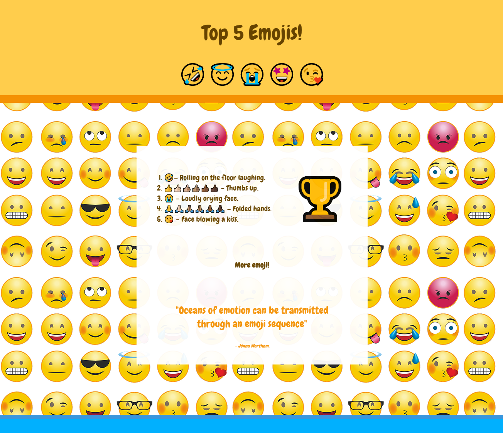

## O que vem depois?

Se você estiver seguindo o caminho [Introdução à web](https://projects.raspberrypi.org/pt-BR/pathways/web-intro), você pode passar para o projeto [Cinco principais emojis](https://projects.raspberrypi.org/pt-BR/projects/top-5-emoji-list). Neste projeto, faça uma lista dos seus cinco emojis favoritos, usando efeitos de animação.

--- print-only ---

--- /print-only ---

--- no-print ---

--- task ---

### Tente isso

  
Assista às animações nesta página Web. Com que frequência eles se repetem? Você consegue identificar uma lista, citação e link?

<iframe src="https://editor.raspberrypi.org/pt-BR/embed/viewer/top-5-emoji-list" width="500" height="700" frameborder="0" marginwidth="0" marginheight="0" allowfullscreen> </iframe>

--- /task ---

--- /no-print ---

***

Este projeto foi traduzido por voluntários:

Keila Resende
Alice-Isabella Oliveira

Graças a voluntários, podemos dar às pessoas de todo o mundo a chance de aprender em seu próprio idioma. Você pode nos ajudar a alcançar mais pessoas oferecendo-se para traduzir - mais informações em [rpf.io/translate](https://rpf.io/translate).
