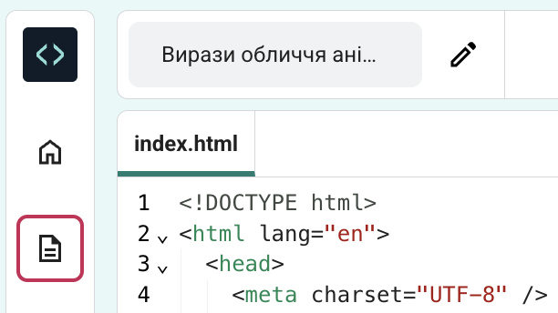

## Додай стиль до своєї сторінки

<div style="display: flex; flex-wrap: wrap">
<div style="flex-basis: 200px; flex-grow: 1; margin-right: 15px;">

Ми використали мову HTML, щоб додати до твоєї вебсторінки теги.

Тепер час використати CSS і додати до неї стилі.

На цьому кроці ти дізнаєшся, як змінити кольори, шрифти і макет своєї вебсторінки.

</div>
<div>
<iframe src="https://editor.raspberrypi.org/en/embed/viewer/anime-expressions-step-4" width="500" height="400" frameborder="0" marginwidth="0" marginheight="0" allowfullscreen> </iframe>
</div>
</div>

<p style="border-left: solid; border-width:10px; border-color: #0faeb0; background-color: aliceblue; padding: 10px;">
<span style="color: #0faeb0">**Cascading Style Sheets (CSS, вимовляється «сі-ес-ес»)**</span> — це мова програмування, за допомогою якої ти вкажеш браузеру, як саме має виглядати твоя сторінка (наприклад, розміщення елементів, кольори й шрифти). Це називається «стилем».
</p>

Кожне **правило** в CSS складається з двох частин: **селектора** й **оголошення**.

**Селектор** – це частина HTML, до якої ти хочеш додати стиль. У цьому прикладі це `h1`.

<div style="background-color:#2d2d2d; padding: 1em;">
  <pre><span style="color:#000; background-color:#d2d2d2; font-family: Consolas, Monaco, 'Andale Mono', 'Ubuntu Mono', monospace; font-size: 1em">h1 </span
  ><span style=" color:#ccc;  font-family: Consolas, Monaco, 'Andale Mono', 'Ubuntu Mono', monospace; font-size: 1em">{
  color: blue;
  font-size: 12px;
}</span></pre>
</div>
<br/>

**Оголошення** міститься у фігурних дужках `{}`. Воно вказує, які саме стилі слід використовувати.

<div style="background-color:#2d2d2d; padding: 1em;">
<pre><span style="color:#ccc; font-family: Consolas, Monaco, 'Andale Mono', 'Ubuntu Mono', monospace; font-size: 1em">h1 </span
><span style=" color:#000; background-color:#d2d2d2; font-family: Consolas, Monaco, 'Andale Mono', 'Ubuntu Mono', monospace; font-size: 1em">{
  color: blue;
  font-size: 12px;
}</span></pre>
</div>
<br/>

### Посилання на файл CSS

Початковий проєкт містить файли CSS з набором корисних правил.

\--- task ---

Розгорни секцію `<head>` у своєму коді, щоб можна було її переглянути.


\--- /task ---

\--- task ---

Унизу секції `<head></head>` є посилання на дві таблиці стилів CSS, які поки що позначені символами коментарів, тому браузер їх ігнорує.

Видали стрілки `<!--` і `--> ` з початку та кінця обох рядків коду посилання:

**До**

## --- code ---

language: html
filename: index.html
line_numbers: true
line_number_start: 21
line_highlights: 23-24
-----------------------------------------------------------

```
<!-- Посилання на файл стилів CSS -->

<!-- <link href="style.css" rel="stylesheet" type="text/css" /> -->
<!-- <link href="candy.css" rel="stylesheet" type="text/css" /> -->
```

  </head>

\--- /code ---

**Після**

## --- code ---

language: html
filename: index.html
line_numbers: true
line_number_start: 21
line_highlights: 23-24
-----------------------------------------------------------

```
<!-- Посилання на файл стилів CSS -->

<link href="style.css" rel="stylesheet" type="text/css" />
<link href="candy.css" rel="stylesheet" type="text/css" />
```

  </head>

\--- /code ---
\--- /task ---

\--- task ---

**Протестуй:** натисни на кнопку **Run**.

Елементи HTML мають стандартні стилі браузера, які ми бачили під час написання коду HTML.

Подивись на свою сторінку у правій частині екрана. Зверни увагу, що стилі та макет сторінки тепер інші.

**Порада:** щоб згорнути секцію `<head>` після того, як ти побачиш зміни, натисни на стрілку поруч із нею.

\--- /task ---

\--- task ---

Клацни значок `Project files` (файли проєкту) в редакторі коду, а потім вибери файл style.css. Він відкриється у новій вкладці.




Цей файл CSS містить увесь код CSS для твого проєкту. Ти дізнаєшся про основні частини цього файлу CSS, продовжуючи створювати свою вебсторінку.

Коли ти додаєш стиль CSS до **елемента**, то цей стиль застосовується до кожного елемента на сторінці, який має той самий тег.

**Знайди:** прокрути сторінку вниз і знайди правило, яке керує стилем `<h2>`.

## --- code ---

language: css
filename: style.css
line_numbers: true
line_number_start: 109
line_highlights: 109-113
-------------------------------------------------------------

h2 {
font: var(--title-font); /\* Стиль шрифту зберігається у змінній title-font _/
text-align: left; /_ Вирівняти текст _/
padding: 1.5rem; /_ Додай трохи місця навколо заголовка \*/
}

\--- /code ---

Це правило визначає, який шрифт слід використовувати, як має бути вирівняний текст і скільки місця має бути навколо заголовка.

\--- /task ---

\--- task ---

Наразі заголовок `<h2>` вирівняно по лівій стороні.

Зміни властивість `text-align` правила `h2` на `center`.

## --- code ---

language: css
filename: style.css
line_numbers: true
line_number_start: 109
line_highlights: 111
---------------------------------------------------------

h2 {
font: var(--title-font); /\* Стиль шрифту зберігається у змінній title-font _/
text-align: center; /_ Вирівняти текст _/
padding: 1.5rem; /_ Додай трохи місця навколо заголовка \*/
}

\--- /code ---

\--- /task ---

\--- task ---

**Протестуй:** натисни на кнопку **Run**.

Подивися на свою сторінку та переконайся, що текст «Вирази обличчя» розміщено по центру.

**Налагодження:** перевір написання слова `center`. Воно має виглядати як `center`, а не centre.

<iframe src="https://editor.raspberrypi.org/en/embed/viewer/anime-expressions-step-4" width="500" height="750" frameborder="0" marginwidth="0" marginheight="0" allowfullscreen> </iframe>

\--- /task ---

