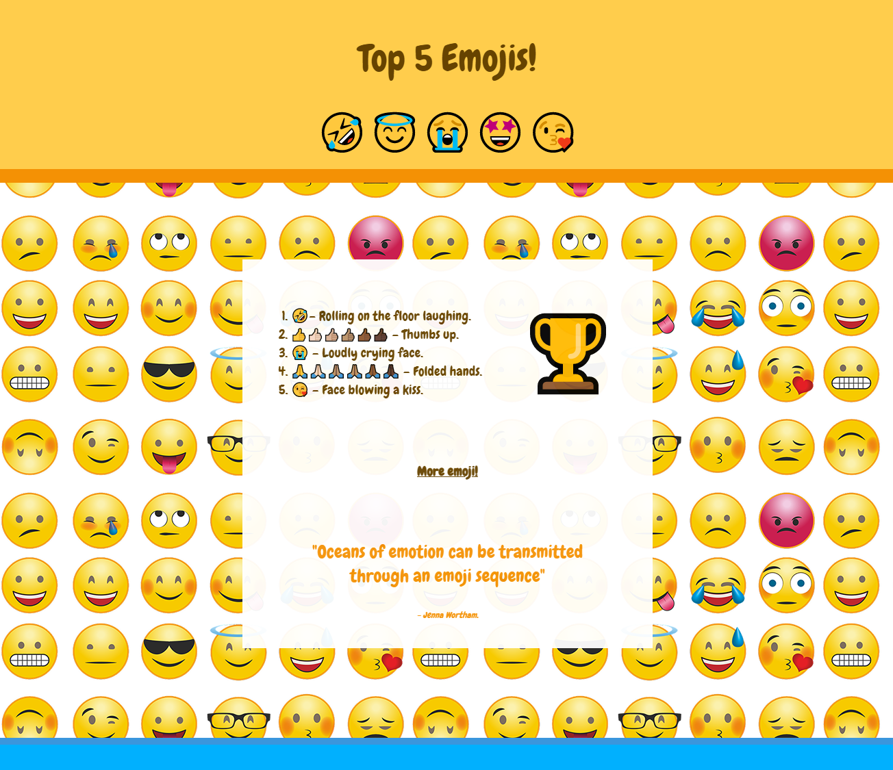

## Що далі?

Якщо ти йдеш напрямом [Вступ до веброзробки](https://projects.raspberrypi.org/uk-UA/pathways/web-intro), можеш переходити до наступного проєкту — [Пʼять найкращих емоджі](https://projects.raspberrypi.org/uk-UA/projects/top-5-emoji-list). У цьому проєкті ти створиш список із п’яти своїх улюблених емоджі, використовуючи ефекти анімації.

--- print-only ---

--- /print-only ---

--- no-print ---

--- task ---

### Спробуй

  
Переглянь анімації на цій вебсторінці. Як часто вони повторюються? Чи можеш ти знайти список, цитату і посилання?

<iframe src="https://editor.raspberrypi.org/uk-UA/embed/viewer/top-5-emoji-list" width="500" height="700" frameborder="0" marginwidth="0" marginheight="0" allowfullscreen> </iframe>

--- /task ---

--- /no-print ---

***

Цей проєкт переклали волонтери.

Завдяки волонтерам ми надаємо можливість людям у всьому світі навчатися рідною мовою. Ви також можете допомогти нам у цьому — більше інформації про волонтерську програму на [rpf.io/translate](https://rpf.io/translate).
